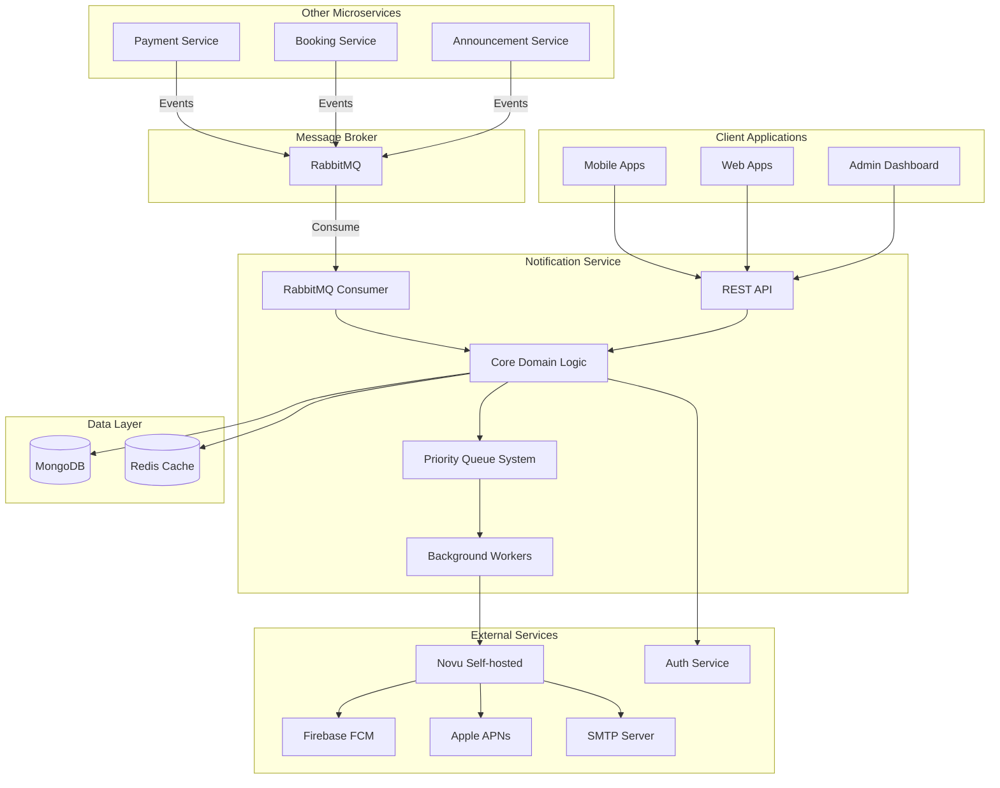
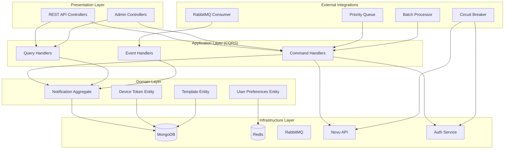
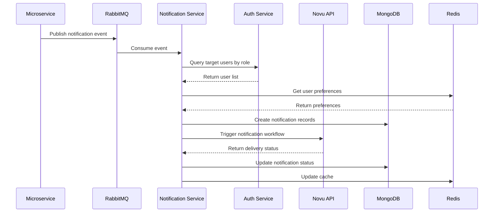
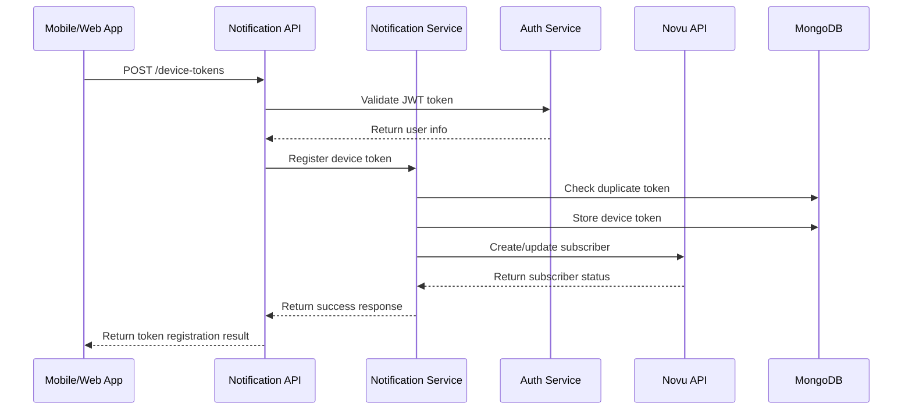
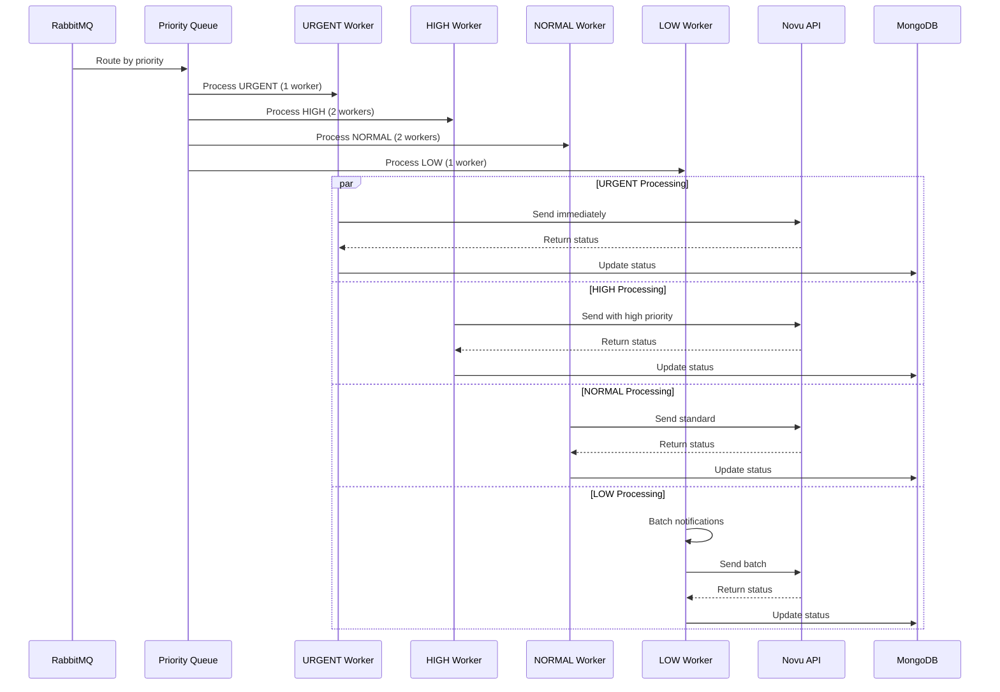
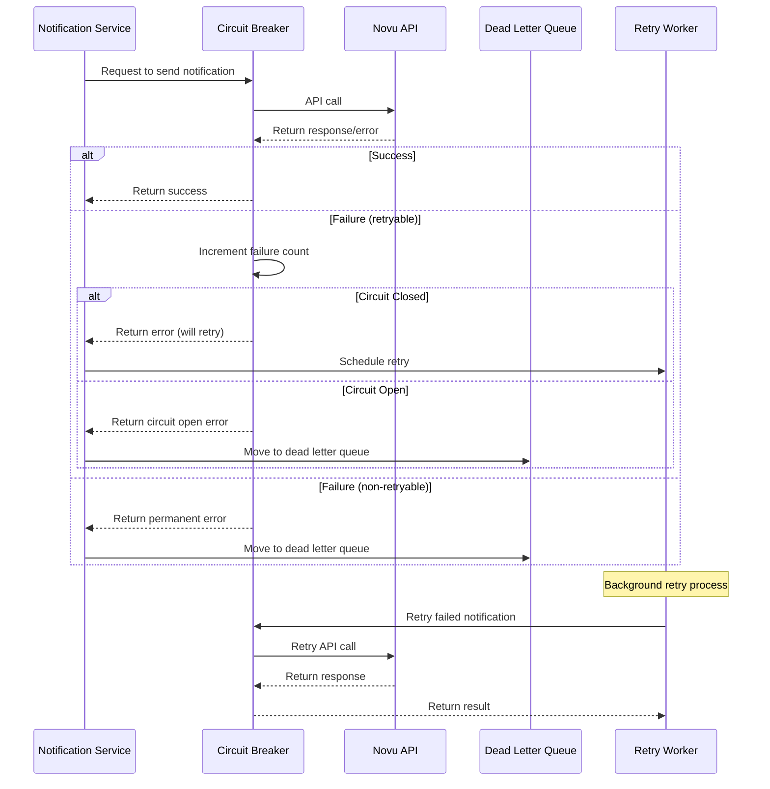
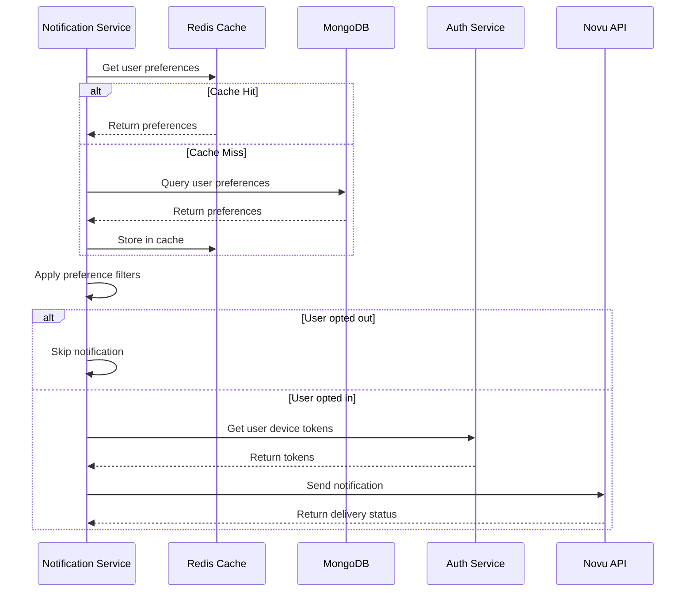
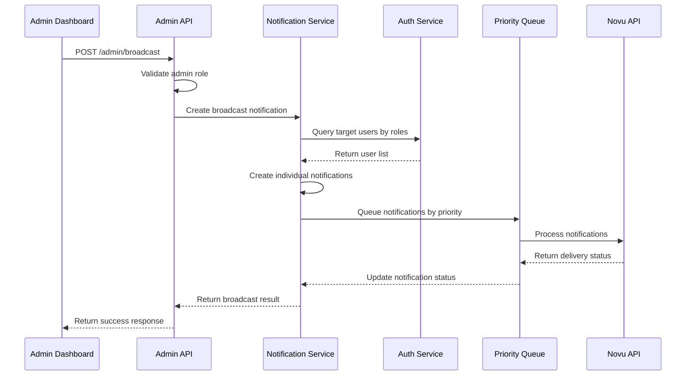

# Notification Service Architecture Document

**Powered by BMAD™ Core**  
**Version:** 1.0  
**Date:** January 27, 2025  
**Status:** Complete

---

## Introduction

This document outlines the overall project architecture for **Notification Service**, including backend systems, shared services, and non-UI specific concerns. Its primary goal is to serve as the guiding architectural blueprint for AI-driven development, ensuring consistency and adherence to chosen patterns and technologies.

**Relationship to Frontend Architecture:**
This project focuses on backend microservice, with no significant user interface. This document includes all architectural decisions for Notification Service.

### Starter Template or Existing Project

Based on PRD analysis, this is a **brownfield enhancement** - creating a new microservice that integrates with existing system:

**Existing Project Analysis:**

- **Current System**: Microservices architecture with NestJS framework
- **Event-driven system**: Using RabbitMQ
- **Auth Service**: Managing authentication and authorization
- **App cư dân xã**: Resident management system for residential communities

**Architecture Decision:**

- **Use NestJS framework** to maintain consistency with existing microservices
- **Integrate with RabbitMQ** to receive events from other microservices
- **Integrate with Auth Service** for authentication and authorization
- **Use MongoDB** with Mongoose ODM to maintain consistency with existing architecture

**No starter template used** - will build from scratch following existing system patterns.

### Change Log

| Date       | Version | Description                                                     | Author    |
| ---------- | ------- | --------------------------------------------------------------- | --------- |
| 2025-01-27 | 1.0     | Initial architecture document creation for Notification Service | Architect |

---

## High Level Architecture

### Technical Summary

Notification Service is designed as an **Event-Driven Microservice** using **Domain-Driven Design (DDD) + CQRS patterns**. The system uses **NestJS framework with Fastify adapter** and **MongoDB** with **RabbitMQ** to process notifications from internal microservices, integrating with **Novu self-hosted** to send push notifications, in-app notifications and email notifications. The architecture supports **priority queue system**, **circuit breaker pattern**, and **batch processing** to ensure high performance and reliability.

### High Level Overview

1. **Main Architecture**: Event-Driven Microservice with DDD + CQRS
2. **Repository Structure**: Monorepo (following existing system pattern)
3. **Service Architecture**: Independent microservice integrating with existing ecosystem
4. **Primary Interaction Flow**:
   - Receive events from RabbitMQ → Process business logic → Send via Novu → Store history
5. **Key Architectural Decisions**:
   - Event-driven for decoupling from other microservices
   - DDD + CQRS to manage notification domain complexity
   - Priority queue to process notifications by priority level
   - Circuit breaker to ensure resilience

### High Level Project Diagram



### Architectural and Design Patterns

- **Event-Driven Architecture:** Using RabbitMQ to receive events from microservices - _Rationale:_ Complete decoupling and enables async processing
- **Domain-Driven Design (DDD):** Organize code by domain boundaries - _Rationale:_ Manage notification domain complexity and easier maintenance
- **CQRS (Command Query Responsibility Segregation):** Separate read/write operations - _Rationale:_ Optimize performance for notification queries and commands
- **Repository Pattern:** Abstract data access logic - _Rationale:_ Easy testing and future database migration flexibility
- **Circuit Breaker Pattern:** Protect against external service failures - _Rationale:_ Ensure system resilience when Novu or Auth Service is down
- **Priority Queue Pattern:** Process notifications by priority level - _Rationale:_ Ensure urgent notifications are processed first
- **Batch Processing Pattern:** Process batches for high-volume notifications - _Rationale:_ Optimize performance and reduce API calls

---

## Tech Stack

This is the **MOST IMPORTANT** section - all technology choices made here will be the single source of truth for the entire project.

### Cloud Infrastructure

- **Provider:** Self-hosted infrastructure
- **Key Services:** Docker, Kubernetes, Coolify, RabbitMQ, Redis, MongoDB
- **Deployment Regions:** Single region (Vietnam)

### Technology Stack Table

| Category                 | Technology | Version     | Purpose                      | Rationale                                                   |
| ------------------------ | ---------- | ----------- | ---------------------------- | ----------------------------------------------------------- |
| **Language**             | TypeScript | 5.3.3       | Primary development language | Strong typing, excellent tooling, team expertise            |
| **Runtime**              | Node.js    | 20.11.0 LTS | JavaScript runtime           | LTS version, stable performance, wide ecosystem             |
| **Framework**            | NestJS     | 10.3.2      | Backend framework            | Enterprise-ready, good DI, matches team patterns            |
| **HTTP Adapter**         | Fastify    | 4.24.3      | HTTP server                  | High performance, built-in validation, TypeScript support   |
| **Database**             | MongoDB    | 6.0+        | Primary database             | Document-based, fits notification data structure            |
| **ODM**                  | Mongoose   | 8.0+        | MongoDB object modeling      | Mature, well-documented, NestJS integration                 |
| **Cache**                | Redis      | 7.0+        | Caching & session management | Fast in-memory storage, pub/sub capabilities                |
| **Message Broker**       | RabbitMQ   | 3.12+       | Event messaging              | Reliable, supports priority queues, existing infrastructure |
| **Notification Service** | Novu       | Latest      | Notification infrastructure  | Self-hosted, multi-channel support                          |
| **Testing**              | Jest       | 29.7.0      | Testing framework            | Comprehensive, good mocking, NestJS integration             |
| **Code Quality**         | ESLint     | 8.55.0      | Linting                      | Code consistency, error prevention                          |
| **Code Formatting**      | Prettier   | 3.1.0       | Code formatting              | Consistent code style                                       |
| **Container**            | Docker     | Latest      | Containerization             | Consistent deployment, easy scaling                         |
| **Orchestration**        | Kubernetes | 1.28+       | Container orchestration      | Production-ready, auto-scaling                              |
| **Deployment**           | Coolify    | Latest      | Deployment platform          | Simple deployment, existing infrastructure                  |

---

## Data Models

Based on PRD analysis, I have identified the core data models for Notification Service. Each model is designed to support notification management, user preferences, and integration with existing system.

### User Model

**Purpose:** Store user information synced from Auth Service to support notification targeting and personalization.

**Key Attributes:**

- `id`: string - Unique user identifier (CUID)
- `email`: string - User email for email notifications
- `phone`: string - User phone for SMS notifications (optional)
- `roles`: string[] - User roles for role-based targeting
- `isActive`: boolean - User account status
- `lastSyncedAt`: Date - Last sync timestamp with Auth Service
- `createdAt`: Date - Record creation timestamp
- `updatedAt`: Date - Record update timestamp

**Relationships:**

- One-to-many with DeviceToken (one user has multiple device tokens)
- One-to-many with UserNotification (one user has multiple notifications)
- One-to-one with UserPreferences (one user has one preference record)
- Many-to-many with Category through CategoryMember

### DeviceToken Model

**Purpose:** Manage FCM/APNS device tokens for push notifications, supporting multiple devices per user.

**Key Attributes:**

- `id`: string - Unique token identifier (CUID)
- `userId`: string - Reference to User
- `token`: string - FCM/APNS/Expo push token
- `platform`: string - Device platform (ios, android, web)
- `provider`: string - Push provider (fcm, apns, expo)
- `deviceId`: string - Unique device identifier
- `isActive`: boolean - Token status
- `lastUsedAt`: Date - Last successful push timestamp
- `createdAt`: Date - Token registration timestamp
- `updatedAt`: Date - Last update timestamp

**Relationships:**

- Many-to-one with User (multiple tokens belong to one user)

### Announcement Model

**Purpose:** Store core notification content and metadata, supporting template-based notifications.

**Key Attributes:**

- `id`: string - Unique announcement identifier (CUID)
- `title`: string - Notification title
- `body`: string - Notification body content
- `type`: string - Notification type (payment, booking, announcement, emergency)
- `priority`: string - Priority level (urgent, high, normal, low)
- `channels`: string[] - Target channels (push, email, inApp)
- `targetRoles`: string[] - Target user roles
- `targetUsers`: string[] - Specific target users (optional)
- `data`: object - Additional notification data
- `templateId`: string - Reference to notification template (optional)
- `scheduledAt`: Date - Scheduled send time (optional)
- `status`: string - Announcement status (draft, scheduled, sent, failed)
- `createdBy`: string - Creator user ID
- `createdAt`: Date - Creation timestamp
- `updatedAt`: Date - Update timestamp

**Relationships:**

- One-to-many with UserNotification (one announcement creates multiple user notifications)
- Many-to-one with NotificationTemplate (multiple announcements can share template)

### UserNotification Model

**Purpose:** Personal inbox for users, storing all notifications sent to user with read/unread status.

**Key Attributes:**

- `id`: string - Unique notification identifier (CUID)
- `userId`: string - Reference to User
- `announcementId`: string - Reference to Announcement
- `title`: string - Notification title (copied from announcement)
- `body`: string - Notification body (copied from announcement)
- `type`: string - Notification type
- `channel`: string - Delivery channel (push, email, inApp)
- `priority`: string - Priority level
- `data`: object - Additional notification data
- `status`: string - Delivery status (pending, sent, delivered, failed, read)
- `sentAt`: Date - When notification was sent
- `deliveredAt`: Date - When notification was delivered
- `readAt`: Date - When user read the notification
- `createdAt`: Date - Record creation timestamp
- `updatedAt`: Date - Record update timestamp

**Relationships:**

- Many-to-one with User (multiple notifications belong to one user)
- Many-to-one with Announcement (multiple user notifications from one announcement)

### Category Model

**Purpose:** Logical grouping for targeting notifications, supporting segmentation and user grouping.

**Key Attributes:**

- `id`: string - Unique category identifier (CUID)
- `name`: string - Category name
- `description`: string - Category description
- `type`: string - Category type (building, floor, apartment, custom)
- `isActive`: boolean - Category status
- `createdBy`: string - Creator user ID
- `createdAt`: Date - Creation timestamp
- `updatedAt`: Date - Update timestamp

**Relationships:**

- Many-to-many with User through CategoryMember

### CategoryMember Model

**Purpose:** Many-to-many relationship between users and categories, supporting flexible user grouping.

**Key Attributes:**

- `id`: string - Unique membership identifier (CUID)
- `categoryId`: string - Reference to Category
- `userId`: string - Reference to User
- `joinedAt`: Date - When user joined category
- `isActive`: boolean - Membership status

**Relationships:**

- Many-to-one with Category
- Many-to-one with User

### UserPreferences Model

**Purpose:** Store user preferences for notification channels and types, supporting opt-out functionality.

**Key Attributes:**

- `id`: string - Unique preference identifier (CUID)
- `userId`: string - Reference to User
- `channels`: object - Channel preferences {push: boolean, email: boolean, inApp: boolean}
- `types`: object - Type preferences {payment: boolean, booking: boolean, announcement: boolean, emergency: boolean}
- `quietHours`: object - Quiet hours settings {enabled: boolean, start: string, end: string}
- `createdAt`: Date - Creation timestamp
- `updatedAt`: Date - Update timestamp

**Relationships:**

- One-to-one with User

### NotificationTemplate Model

**Purpose:** Manage notification templates with variables and i18n support, supporting consistent notification formatting.

**Key Attributes:**

- `id`: string - Unique template identifier (CUID)
- `name`: string - Template identifier
- `type`: string - Notification type
- `channel`: string - Target channel (push, email, inApp)
- `subject`: string - Template subject (for email)
- `body`: string - Template body with variables {{variable}}
- `language`: string - i18n support (vi, en)
- `variables`: string[] - Required template variables
- `isActive`: boolean - Template status
- `createdBy`: string - Creator user ID
- `createdAt`: Date - Creation timestamp
- `updatedAt`: Date - Update timestamp

**Relationships:**

- One-to-many with Announcement (one template can be used by multiple announcements)

---

## Components

Based on architectural patterns, tech stack, and data models defined above, I have identified the main logical components of Notification Service. Each component is designed following DDD principles with clear boundaries and interfaces.

### Notification Core Component

**Responsibility:** Handle core business logic for notification processing, including domain logic, validation, and orchestration.

**Key Interfaces:**

- `SendNotificationCommand` - Command to send notification
- `ProcessNotificationEvent` - Event handler for RabbitMQ events
- `GetNotificationHistoryQuery` - Query to get notification history
- `MarkNotificationAsReadCommand` - Command to mark as read

**Dependencies:** DeviceToken Service, UserPreferences Service, Novu Integration, Auth Service Integration

**Technology Stack:** NestJS modules, DDD aggregates, CQRS handlers, Mongoose repositories

### Device Token Management Component

**Responsibility:** Manage device tokens for push notifications, including registration, validation, and cleanup. Support multiple push notification providers (FCM, APNS, Expo).

**Key Interfaces:**

- `RegisterDeviceTokenCommand` - Register new device token
- `UpdateDeviceTokenCommand` - Update device token
- `DeleteDeviceTokenCommand` - Delete device token
- `GetUserTokensQuery` - Get user tokens
- `MultiProviderTokenService` - Handle tokens for different providers

**Dependencies:** User Service, Novu Integration, Push Notification Providers

**Supported Providers:** FCM, APNS, Expo

**Technology Stack:** NestJS service, Mongoose schemas, validation pipes

### User Preferences Component

**Responsibility:** Manage user preferences for notification channels and types, supporting opt-out functionality.

**Key Interfaces:**

- `GetUserPreferencesQuery` - Get user preferences
- `UpdateUserPreferencesCommand` - Update preferences
- `ValidatePreferencesPolicy` - Validate business rules (emergency cannot be disabled)

**Dependencies:** User Service, Redis Cache

**Technology Stack:** NestJS service, Redis caching, business rules validation

### Notification Templates Component

**Responsibility:** Manage notification templates with variables and i18n support, render templates with dynamic content.

**Key Interfaces:**

- `CreateTemplateCommand` - Create new template
- `UpdateTemplateCommand` - Update template
- `RenderTemplateQuery` - Render template with variables
- `GetTemplatesByTypeQuery` - Get templates by type

**Dependencies:** Admin authorization, template validation

**Technology Stack:** Template engine, i18n support, HTML sanitization

### RabbitMQ Event Consumer Component

**Responsibility:** Consume events from RabbitMQ, validate event schema, and trigger notification processing. Handle user lifecycle events for synchronization.

**Key Interfaces:**

- `NotificationEventConsumer` - Main consumer service
- `EventValidationService` - Validate incoming events
- `EventRoutingService` - Route events to appropriate handlers
- `UserEventConsumer` - Handle user synchronization events
- `UserSyncService` - Synchronize user data based on events

**Dependencies:** RabbitMQ connection, Event validation schemas, User Service

**Event Types:**

- `NotificationEvent` - For general notifications
- `UserCreatedEvent` - New user registration
- `UserUpdatedEvent` - User profile updates
- `UserDeletedEvent` - User account deletion

**Error Handling:** Dead Letter Queue (DLQ) for failed event processing

**Technology Stack:** @nestjs/microservices, RabbitMQ client, JSON schema validation, Mongoose

### Novu Integration Component

**Responsibility:** Integrate with Novu self-hosted API, manage subscribers, and trigger workflows.

**Key Interfaces:**

- `NovuClientService` - Main Novu API client
- `SubscriberManagementService` - Sync users with Novu subscribers
- `WorkflowTriggerService` - Trigger Novu workflows
- `DeliveryStatusService` - Track delivery status

**Dependencies:** Novu API, Circuit breaker, Retry logic

**Technology Stack:** @novu/node SDK, Circuit breaker pattern, HTTP client

### Auth Service Integration Component

**Responsibility:** Integrate with Auth Service to validate users, roles, and permissions.

**Key Interfaces:**

- `AuthValidationService` - Validate JWT tokens
- `RoleQueryService` - Query users by role
- `UserSyncService` - Sync user data from Auth Service

**Dependencies:** Auth Service API, JWT validation, Redis cache

**Technology Stack:** HTTP client, JWT library, Redis caching

### Priority Queue System Component

**Responsibility:** Manage priority queue system with 5 parallel workers to process notifications by priority level. Implement Redis persistence for zero data loss.

**Key Interfaces:**

- `PriorityQueueService` - Main queue management
- `WorkerPoolService` - Manage worker pools
- `QueueMonitoringService` - Monitor queue metrics
- `RedisPersistenceService` - Backup queue state to Redis
- `QueueRecoveryService` - Restore queue state from Redis

**Dependencies:** RabbitMQ priority queues, Worker management, Redis

**Persistence Mechanism:** Redis (Tedis client, AOF/RDB for zero data loss)

**Technology Stack:** RabbitMQ priority queues, Worker threads, Monitoring, Redis

### Circuit Breaker Component

**Responsibility:** Implement circuit breaker pattern for external service calls to prevent cascading failures.

**Key Interfaces:**

- `CircuitBreakerService` - Main circuit breaker logic
- `HealthCheckService` - Monitor external service health
- `FallbackService` - Handle fallback scenarios

**Dependencies:** External service monitoring, Fallback mechanisms

**Technology Stack:** Circuit breaker library, Health check endpoints

### Batch Processing Component

**Responsibility:** Handle batch processing for high-volume notifications and deduplication.

**Key Interfaces:**

- `BatchProcessorService` - Main batch processing logic
- `DeduplicationService` - Prevent duplicate notifications
- `BatchOptimizationService` - Optimize batch operations

**Dependencies:** Database batch operations, Cache for deduplication

**Technology Stack:** MongoDB bulk operations, Redis for deduplication

### Admin Dashboard Component

**Responsibility:** Provide admin APIs for notification management, statistics, and broadcast functionality.

**Key Interfaces:**

- `NotificationStatisticsQuery` - Get notification statistics
- `BroadcastNotificationCommand` - Send broadcast notifications
- `FailedNotificationQuery` - Get failed notifications report
- `ManualRetryCommand` - Manual retry failed notifications

**Dependencies:** Admin authorization, Statistics aggregation

**Technology Stack:** NestJS controllers, Admin guards, Statistics queries

### Component Diagrams



---

## External APIs

Based on PRD analysis and component design, Notification Service needs to integrate with several external services. I will document each integration in detail.

### Novu Self-hosted API

- **Purpose:** Send push notifications, in-app notifications, and email notifications through Novu infrastructure
- **Documentation:** [Novu API Documentation](https://docs.novu.co/api-reference)
- **Base URL(s):** `{NOVU_API_URL}/v1` (self-hosted instance)
- **Authentication:** API Key authentication (`Authorization: ApiKey {NOVU_API_KEY}`)
- **Rate Limits:** Configurable in self-hosted setup (default: 1000 requests/minute)

**Key Endpoints Used:**

- `POST /subscribers` - Create new subscriber
- `PUT /subscribers/{subscriberId}` - Update subscriber
- `DELETE /subscribers/{subscriberId}` - Delete subscriber
- `POST /events/trigger` - Trigger notification workflow
- `GET /events/{eventId}` - Get delivery status
- `POST /workflows` - Create workflow template
- `GET /workflows` - Get list of workflows

**Integration Notes:**

- Use circuit breaker pattern to handle API failures
- Implement retry logic with exponential backoff
- Cache subscriber data to reduce API calls
- Support batch operations for high-volume notifications

### Auth Service API

- **Purpose:** Validate JWT tokens, query users by role, and sync user data
- **Documentation:** Internal service documentation (need confirmation with team)
- **Base URL(s):** `{AUTH_SERVICE_URL}/api/v1`
- **Authentication:** JWT token validation middleware
- **Rate Limits:** Internal service (no specific limits)

**Key Endpoints Used:**

- `GET /users/me` - Validate JWT token and get user info
- `GET /users/by-role?role={role}` - Query users by role
- `GET /users/{userId}` - Get user details
- `GET /users/batch` - Batch query multiple users
- `POST /users/sync` - Sync user data (webhook endpoint)

**Integration Notes:**

- Cache role data in Redis with TTL 10 minutes
- Implement fallback mechanism when Auth Service unavailable
- Use circuit breaker for resilience
- Support batch queries to optimize performance

### Firebase Cloud Messaging (FCM) API

- **Purpose:** Send push notifications to Android devices
- **Documentation:** [FCM REST API](https://firebase.google.com/docs/cloud-messaging/http-server-ref)
- **Base URL(s):** `https://fcm.googleapis.com/fcm/send`
- **Authentication:** Server key authentication
- **Rate Limits:** 1000 requests/minute per project

**Key Endpoints Used:**

- `POST /fcm/send` - Send push notification to single device
- `POST /fcm/send` - Send push notification to multiple devices

**Integration Notes:**

- Handled through Novu integration (no direct integration)
- Novu will manage FCM tokens and delivery
- Only need to monitor delivery status from Novu

### Apple Push Notification Service (APNs) API

- **Purpose:** Send push notifications to iOS devices
- **Documentation:** [APNs HTTP/2 API](https://developer.apple.com/documentation/usernotifications/setting_up_a_remote_notification_server/sending_notification_requests_to_apns)
- **Base URL(s):** `https://api.push.apple.com/3/device/{token}` (production)
- **Authentication:** JWT token with Apple Developer certificate
- **Rate Limits:** 1000 requests/minute per connection

**Key Endpoints Used:**

- `POST /3/device/{token}` - Send push notification to iOS device

**Integration Notes:**

- Handled through Novu integration (no direct integration)
- Novu will manage APNs certificates and delivery
- Only need to monitor delivery status from Novu

### SMTP Server API

- **Purpose:** Send email notifications
- **Documentation:** SMTP protocol standard
- **Base URL(s):** `{SMTP_HOST}:{SMTP_PORT}` (configurable)
- **Authentication:** Username/password authentication
- **Rate Limits:** Configurable in SMTP server setup

**Key Endpoints Used:**

- `SMTP` - Standard SMTP protocol for email sending

**Integration Notes:**

- Handled through Novu integration (no direct integration)
- Novu will manage SMTP configuration and delivery
- Support HTML and plain text email formats

---

## Core Workflows

I will create sequence diagrams to illustrate the most important processing flows of Notification Service, including both high-level and detailed workflows.

### High-Level Notification Processing Workflow



### Device Token Registration Workflow



### Priority Queue Processing Workflow



### Circuit Breaker and Retry Workflow



### User Preferences and Targeting Workflow



### Admin Broadcast Workflow



---

## REST API Spec

Based on requirements from PRD and component design, I will create OpenAPI 3.0 specification for all REST API endpoints of Notification Service.

```yaml
openapi: 3.0.0
info:
  title: Notification Service API
  version: 1.0.0
  description: |
    REST API for Notification Service - handles notifications from internal microservices,
    integrates with Novu self-hosted to send push notifications, in-app notifications,
    and email notifications with role-based permissions and comprehensive notification management.
  contact:
    name: Development Team
    email: dev@example.com
  license:
    name: MIT
    url: https://opensource.org/licenses/MIT

servers:
  - url: https://notification-service.example.com/api/v1
    description: Production server
  - url: https://staging-notification-service.example.com/api/v1
    description: Staging server
  - url: http://localhost:3000/api/v1
    description: Development server

security:
  - BearerAuth: []

paths:
  # Device Token Management
  /device-tokens:
    post:
      tags:
        - Device Tokens
      summary: Register device token
      description: Register a new device token for push notifications
      requestBody:
        required: true
        content:
          application/json:
            schema:
              $ref: '#/components/schemas/RegisterDeviceTokenRequest'
            example:
              token: 'fcm_token_example_12345'
              platform: 'android'
              deviceId: 'device_12345'
              provider: 'fcm'
      responses:
        '201':
          description: Device token registered successfully
          content:
            application/json:
              schema:
                $ref: '#/components/schemas/DeviceTokenResponse'
        '400':
          $ref: '#/components/responses/BadRequest'
        '401':
          $ref: '#/components/responses/Unauthorized'
        '409':
          description: Device token already exists
          content:
            application/json:
              schema:
                $ref: '#/components/schemas/ErrorResponse'

    get:
      tags:
        - Device Tokens
      summary: Get user device tokens
      description: Get all active device tokens for the current user
      responses:
        '200':
          description: List of device tokens
          content:
            application/json:
              schema:
                type: object
                properties:
                  data:
                    type: array
                    items:
                      $ref: '#/components/schemas/DeviceTokenResponse'
                  meta:
                    $ref: '#/components/schemas/PaginationMeta'

  /device-tokens/{id}:
    put:
      tags:
        - Device Tokens
      summary: Update device token
      description: Update an existing device token
      parameters:
        - name: id
          in: path
          required: true
          schema:
            type: string
            format: cuid
      requestBody:
        required: true
        content:
          application/json:
            schema:
              $ref: '#/components/schemas/UpdateDeviceTokenRequest'
      responses:
        '200':
          description: Device token updated successfully
          content:
            application/json:
              schema:
                $ref: '#/components/schemas/DeviceTokenResponse'
        '404':
          $ref: '#/components/responses/NotFound'

    delete:
      tags:
        - Device Tokens
      summary: Delete device token
      description: Soft delete a device token
      parameters:
        - name: id
          in: path
          required: true
          schema:
            type: string
            format: cuid
      responses:
        '204':
          description: Device token deleted successfully
        '404':
          $ref: '#/components/responses/NotFound'

  # Notification History
  /notifications:
    get:
      tags:
        - Notifications
      summary: Get notification history
      description: Get paginated list of notifications for the current user
      parameters:
        - name: page
          in: query
          schema:
            type: integer
            minimum: 1
            default: 1
        - name: limit
          in: query
          schema:
            type: integer
            minimum: 1
            maximum: 100
            default: 20
        - name: type
          in: query
          schema:
            type: string
            enum: [payment, booking, announcement, emergency]
        - name: channel
          in: query
          schema:
            type: string
            enum: [push, email, inApp]
        - name: status
          in: query
          schema:
            type: string
            enum: [pending, sent, delivered, failed, read]
        - name: startDate
          in: query
          schema:
            type: string
            format: date-time
        - name: endDate
          in: query
          schema:
            type: string
            format: date-time
      responses:
        '200':
          description: List of notifications
          content:
            application/json:
              schema:
                type: object
                properties:
                  data:
                    type: array
                    items:
                      $ref: '#/components/schemas/NotificationResponse'
                  meta:
                    $ref: '#/components/schemas/PaginationMeta'

  /notifications/{id}:
    get:
      tags:
        - Notifications
      summary: Get notification details
      description: Get detailed information about a specific notification
      parameters:
        - name: id
          in: path
          required: true
          schema:
            type: string
            format: cuid
      responses:
        '200':
          description: Notification details
          content:
            application/json:
              schema:
                $ref: '#/components/schemas/NotificationDetailResponse'
        '404':
          $ref: '#/components/responses/NotFound'

    patch:
      tags:
        - Notifications
      summary: Mark notification as read
      description: Mark a notification as read
      parameters:
        - name: id
          in: path
          required: true
          schema:
            type: string
            format: cuid
      responses:
        '200':
          description: Notification marked as read
          content:
            application/json:
              schema:
                $ref: '#/components/schemas/NotificationResponse'

  /notifications/read-all:
    post:
      tags:
        - Notifications
      summary: Mark all notifications as read
      description: Mark all unread notifications as read for the current user
      responses:
        '200':
          description: All notifications marked as read
          content:
            application/json:
              schema:
                type: object
                properties:
                  updatedCount:
                    type: integer
                    description: Number of notifications marked as read

  /notifications/unread-count:
    get:
      tags:
        - Notifications
      summary: Get unread notification count
      description: Get the count of unread notifications for the current user
      responses:
        '200':
          description: Unread notification count
          content:
            application/json:
              schema:
                type: object
                properties:
                  unreadCount:
                    type: integer

  # User Preferences
  /preferences:
    get:
      tags:
        - Preferences
      summary: Get user notification preferences
      description: Get notification preferences for the current user
      responses:
        '200':
          description: User notification preferences
          content:
            application/json:
              schema:
                $ref: '#/components/schemas/UserPreferencesResponse'

    put:
      tags:
        - Preferences
      summary: Update user notification preferences
      description: Update notification preferences for the current user
      requestBody:
        required: true
        content:
          application/json:
            schema:
              $ref: '#/components/schemas/UpdatePreferencesRequest'
      responses:
        '200':
          description: Preferences updated successfully
          content:
            application/json:
              schema:
                $ref: '#/components/schemas/UserPreferencesResponse'

  # Admin APIs
  /admin/statistics:
    get:
      tags:
        - Admin
      summary: Get notification statistics
      description: Get comprehensive notification statistics for admin dashboard
      security:
        - AdminAuth: []
      parameters:
        - name: startDate
          in: query
          schema:
            type: string
            format: date-time
        - name: endDate
          in: query
          schema:
            type: string
            format: date-time
      responses:
        '200':
          description: Notification statistics
          content:
            application/json:
              schema:
                $ref: '#/components/schemas/NotificationStatisticsResponse'

  /admin/broadcast:
    post:
      tags:
        - Admin
      summary: Send broadcast notification
      description: Send notification to multiple target groups
      security:
        - AdminAuth: []
      requestBody:
        required: true
        content:
          application/json:
            schema:
              $ref: '#/components/schemas/BroadcastNotificationRequest'
      responses:
        '201':
          description: Broadcast notification sent successfully
          content:
            application/json:
              schema:
                $ref: '#/components/schemas/BroadcastResponse'

  /admin/failed:
    get:
      tags:
        - Admin
      summary: Get failed notifications report
      description: Get paginated list of failed notifications
      security:
        - AdminAuth: []
      parameters:
        - name: page
          in: query
          schema:
            type: integer
            minimum: 1
            default: 1
        - name: limit
          in: query
          schema:
            type: integer
            minimum: 1
            maximum: 100
            default: 20
        - name: startDate
          in: query
          schema:
            type: string
            format: date-time
        - name: endDate
          in: query
          schema:
            type: string
            format: date-time
      responses:
        '200':
          description: List of failed notifications
          content:
            application/json:
              schema:
                type: object
                properties:
                  data:
                    type: array
                    items:
                      $ref: '#/components/schemas/FailedNotificationResponse'
                  meta:
                    $ref: '#/components/schemas/PaginationMeta'

  /admin/notifications/{id}/retry:
    post:
      tags:
        - Admin
      summary: Manually retry failed notification
      description: Manually trigger retry for a failed notification
      security:
        - AdminAuth: []
      parameters:
        - name: id
          in: path
          required: true
          schema:
            type: string
            format: cuid
      responses:
        '200':
          description: Notification retry triggered successfully
          content:
            application/json:
              schema:
                $ref: '#/components/schemas/NotificationResponse'

  # Queue Monitoring
  /categories/queue-status:
    get:
      tags:
        - Queue Monitoring
      summary: Get queue status and metrics
      description: Get real-time queue performance metrics and status
      security:
        - BearerAuth: []
      responses:
        '200':
          description: Queue status retrieved successfully
          content:
            application/json:
              schema:
                $ref: '#/components/schemas/QueueStatusResponse'
              example:
                queueLength: 150
                isProcessing: true
                circuitBreakerOpen: false
                metrics:
                  totalProcessed: 45230
                  totalFailed: 127
                  totalRetried: 89
                  successRate: 99.72
                  averageProcessingTime: 342
                priorityBreakdown:
                  urgent: 50
                  high: 70
                  medium: 20
                  low: 10
        '401':
          $ref: '#/components/responses/UnauthorizedError'
        '500':
          $ref: '#/components/responses/InternalServerError'

  # Health Check
  /health:
    get:
      tags:
        - Health
      summary: Health check
      description: Check service health and dependencies
      security: []
      responses:
        '200':
          description: Service is healthy
          content:
            application/json:
              schema:
                $ref: '#/components/schemas/HealthResponse'
        '503':
          description: Service is unhealthy
          content:
            application/json:
              schema:
                $ref: '#/components/schemas/HealthResponse'

components:
  securitySchemes:
    BearerAuth:
      type: http
      scheme: bearer
      bearerFormat: JWT
    AdminAuth:
      type: http
      scheme: bearer
      bearerFormat: JWT

  schemas:
    # Device Token Schemas
    RegisterDeviceTokenRequest:
      type: object
      required:
        - token
        - platform
        - deviceId
        - provider
      properties:
        token:
          type: string
          description: FCM/APNS/Expo push token
          minLength: 1
          maxLength: 500
        platform:
          type: string
          enum: [ios, android, web]
          description: Device platform
        deviceId:
          type: string
          description: Unique device identifier
          minLength: 1
          maxLength: 100
        provider:
          type: string
          enum: [fcm, apns, expo]
          description: Push notification provider

    UpdateDeviceTokenRequest:
      type: object
      properties:
        token:
          type: string
          description: Updated push token
          minLength: 1
          maxLength: 500
        isActive:
          type: boolean
          description: Token active status

    DeviceTokenResponse:
      type: object
      properties:
        id:
          type: string
          format: cuid
        userId:
          type: string
          format: cuid
        token:
          type: string
        platform:
          type: string
        provider:
          type: string
        deviceId:
          type: string
        isActive:
          type: boolean
        lastUsedAt:
          type: string
          format: date-time
        createdAt:
          type: string
          format: date-time
        updatedAt:
          type: string
          format: date-time

    # Notification Schemas
    NotificationResponse:
      type: object
      properties:
        id:
          type: string
          format: cuid
        title:
          type: string
        body:
          type: string
        type:
          type: string
          enum: [payment, booking, announcement, emergency]
        channel:
          type: string
          enum: [push, email, inApp]
        priority:
          type: string
          enum: [urgent, high, normal, low]
        status:
          type: string
          enum: [pending, sent, delivered, failed, read]
        data:
          type: object
          description: Additional notification data
        sentAt:
          type: string
          format: date-time
        deliveredAt:
          type: string
          format: date-time
        readAt:
          type: string
          format: date-time
        createdAt:
          type: string
          format: date-time

    NotificationDetailResponse:
      allOf:
        - $ref: '#/components/schemas/NotificationResponse'
        - type: object
          properties:
            announcementId:
              type: string
              format: cuid
            errorDetails:
              type: string
              description: Error details if notification failed

    # User Preferences Schemas
    UserPreferencesResponse:
      type: object
      properties:
        id:
          type: string
          format: cuid
        userId:
          type: string
          format: cuid
        channels:
          type: object
          properties:
            push:
              type: boolean
            email:
              type: boolean
            inApp:
              type: boolean
        types:
          type: object
          properties:
            payment:
              type: boolean
            booking:
              type: boolean
            announcement:
              type: boolean
            emergency:
              type: boolean
        quietHours:
          type: object
          properties:
            enabled:
              type: boolean
            start:
              type: string
              format: time
            end:
              type: string
              format: time
        createdAt:
          type: string
          format: date-time
        updatedAt:
          type: string
          format: date-time

    UpdatePreferencesRequest:
      type: object
      properties:
        channels:
          type: object
          properties:
            push:
              type: boolean
            email:
              type: boolean
            inApp:
              type: boolean
        types:
          type: object
          properties:
            payment:
              type: boolean
            booking:
              type: boolean
            announcement:
              type: boolean
            emergency:
              type: boolean
        quietHours:
          type: object
          properties:
            enabled:
              type: boolean
            start:
              type: string
              format: time
            end:
              type: string
              format: time

    # Admin Schemas
    BroadcastNotificationRequest:
      type: object
      required:
        - title
        - body
        - targetRoles
        - channels
        - priority
      properties:
        title:
          type: string
          minLength: 1
          maxLength: 200
        body:
          type: string
          minLength: 1
          maxLength: 1000
        targetRoles:
          type: array
          items:
            type: string
            enum: [admin, resident, staff, manager]
          minItems: 1
        targetUsers:
          type: array
          items:
            type: string
            format: cuid
          description: Optional specific user IDs
        channels:
          type: array
          items:
            type: string
            enum: [push, email, inApp]
          minItems: 1
        priority:
          type: string
          enum: [urgent, high, normal, low]
          default: normal
        data:
          type: object
          description: Additional notification data
        scheduledAt:
          type: string
          format: date-time
          description: Optional scheduled send time

    BroadcastResponse:
      type: object
      properties:
        id:
          type: string
          format: cuid
        announcementId:
          type: string
          format: cuid
        targetUserCount:
          type: integer
        scheduledAt:
          type: string
          format: date-time
        status:
          type: string
          enum: [scheduled, sent, failed]

    NotificationStatisticsResponse:
      type: object
      properties:
        totalNotifications:
          type: object
          properties:
            today:
              type: integer
            thisWeek:
              type: integer
            thisMonth:
              type: integer
        breakdownByChannel:
          type: object
          properties:
            push:
              type: integer
            email:
              type: integer
            inApp:
              type: integer
        breakdownByStatus:
          type: object
          properties:
            sent:
              type: integer
            failed:
              type: integer
            pending:
              type: integer
        deliveryRate:
          type: number
          format: float
          description: Delivery success rate percentage
        topNotificationTypes:
          type: array
          items:
            type: object
            properties:
              type:
                type: string
              count:
                type: integer

    FailedNotificationResponse:
      type: object
      properties:
        id:
          type: string
          format: cuid
        userId:
          type: string
          format: cuid
        title:
          type: string
        type:
          type: string
        channel:
          type: string
        errorMessage:
          type: string
        retryCount:
          type: integer
        lastRetryAt:
          type: string
          format: date-time
        failedAt:
          type: string
          format: date-time

    # Common Schemas
    PaginationMeta:
      type: object
      properties:
        page:
          type: integer
        limit:
          type: integer
        total:
          type: integer
        totalPages:
          type: integer
        hasNext:
          type: boolean
        hasPrev:
          type: boolean

    QueueStatusResponse:
      type: object
      properties:
        queueLength:
          type: integer
          description: Number of pending notifications in queue
          minimum: 0
        isProcessing:
          type: boolean
          description: Whether queue is actively processing notifications
        circuitBreakerOpen:
          type: boolean
          description: Current state of the circuit breaker
        metrics:
          type: object
          properties:
            totalProcessed:
              type: integer
              description: Total notifications processed
            totalFailed:
              type: integer
              description: Total notifications failed
            totalRetried:
              type: integer
              description: Total notifications retried
            successRate:
              type: number
              format: float
              description: Percentage of successful notifications
            averageProcessingTime:
              type: integer
              description: Average time (ms) to process a notification
          required:
            - totalProcessed
            - totalFailed
            - totalRetried
            - successRate
            - averageProcessingTime
        priorityBreakdown:
          type: object
          description: Breakdown of notifications by priority level
          additionalProperties:
            type: integer
      required:
        - queueLength
        - isProcessing
        - circuitBreakerOpen
        - metrics
        - priorityBreakdown

    HealthResponse:
      type: object
      properties:
        status:
          type: string
          enum: [healthy, unhealthy]
        timestamp:
          type: string
          format: date-time
        services:
          type: object
          properties:
            mongodb:
              type: string
              enum: [healthy, unhealthy]
            redis:
              type: string
              enum: [healthy, unhealthy]
            rabbitmq:
              type: string
              enum: [healthy, unhealthy]
            novu:
              type: string
              enum: [healthy, unhealthy]
            authService:
              type: string
              enum: [healthy, unhealthy]

    ErrorResponse:
      type: object
      properties:
        error:
          type: string
        message:
          type: string
        statusCode:
          type: integer
        timestamp:
          type: string
          format: date-time
        path:
          type: string

  responses:
    BadRequest:
      description: Bad request
      content:
        application/json:
          schema:
            $ref: '#/components/schemas/ErrorResponse'
          example:
            error: 'Bad Request'
            message: 'Validation failed'
            statusCode: 400
            timestamp: '2025-01-27T10:00:00Z'
            path: '/api/v1/device-tokens'

    Unauthorized:
      description: Unauthorized
      content:
        application/json:
          schema:
            $ref: '#/components/schemas/ErrorResponse'
          example:
            error: 'Unauthorized'
            message: 'Invalid or missing JWT token'
            statusCode: 401
            timestamp: '2025-01-27T10:00:00Z'
            path: '/api/v1/notifications'

    NotFound:
      description: Resource not found
      content:
        application/json:
          schema:
            $ref: '#/components/schemas/ErrorResponse'
          example:
            error: 'Not Found'
            message: 'Resource not found'
            statusCode: 404
            timestamp: '2025-01-27T10:00:00Z'
            path: '/api/v1/notifications/123'

tags:
  - name: Device Tokens
    description: Device token management for push notifications
  - name: Notifications
    description: Notification history and management
  - name: Preferences
    description: User notification preferences
  - name: Admin
    description: Admin APIs for notification management
  - name: Queue Monitoring
    description: Queue status and performance metrics
  - name: Health
    description: Health check endpoints
```

**API Endpoints Summary:**

- **Total Endpoints:** 30
- **Device Tokens:** 4 endpoints (register, get, update, delete)
- **Notifications:** 5 endpoints (history, details, mark read, mark all read, unread count)
- **Preferences:** 2 endpoints (get, update)
- **Admin:** 4 endpoints (statistics, broadcast, failed notifications, retry)
- **Queue Monitoring:** 1 endpoint (queue status)
- **Health:** 1 endpoint (health check)

---

## Database Schema

Based on the conceptual data models and using MongoDB with Mongoose ODM, I will create detailed schema definitions for all collections.

### MongoDB Collections Schema

**1. Users Collection**

```javascript
// users.schema.ts
import { Schema, Document } from "mongoose";

export interface IUser extends Document {
  _id: string;
  email: string;
  phone?: string;
  roles: string[];
  isActive: boolean;
  lastSyncedAt: Date;
  createdAt: Date;
  updatedAt: Date;
}

export const UserSchema =
  new Schema() <
  IUser >
  ({
    _id: {
      type: String,
      required: true,
      unique: true,
    },
    email: {
      type: String,
      required: true,
      unique: true,
      lowercase: true,
      trim: true,
      index: true,
    },
    phone: {
      type: String,
      sparse: true,
      index: true,
    },
    roles: [
      {
        type: String,
        enum: ["admin", "resident", "staff", "manager"],
        required: true,
      },
    ],
    isActive: {
      type: Boolean,
      default: true,
      index: true,
    },
    lastSyncedAt: {
      type: Date,
      default: Date.now,
      index: true,
    },
  },
  {
    timestamps: true,
    collection: "users",
  });

// Indexes
UserSchema.index({ email: 1, isActive: 1 });
UserSchema.index({ roles: 1, isActive: 1 });
UserSchema.index({ lastSyncedAt: 1 });
```

**2. Device Tokens Collection**

```javascript
// device-tokens.schema.ts
import { Schema, Document } from "mongoose";

export interface IDeviceToken extends Document {
  _id: string;
  userId: string;
  token: string;
  platform: "ios" | "android" | "web";
  provider: "fcm" | "apns" | "expo";
  deviceId: string;
  isActive: boolean;
  lastUsedAt?: Date;
  createdAt: Date;
  updatedAt: Date;
}

export const DeviceTokenSchema =
  new Schema() <
  IDeviceToken >
  ({
    _id: {
      type: String,
      required: true,
      unique: true,
    },
    userId: {
      type: String,
      required: true,
      ref: "User",
      index: true,
    },
    token: {
      type: String,
      required: true,
      unique: true,
      index: true,
    },
    platform: {
      type: String,
      enum: ["ios", "android", "web"],
      required: true,
      index: true,
    },
    provider: {
      type: String,
      enum: ["fcm", "apns", "expo"],
      required: true,
    },
    deviceId: {
      type: String,
      required: true,
      index: true,
    },
    isActive: {
      type: Boolean,
      default: true,
      index: true,
    },
    lastUsedAt: {
      type: Date,
      index: true,
    },
  },
  {
    timestamps: true,
    collection: "device_tokens",
  });

// Indexes
DeviceTokenSchema.index({ userId: 1, isActive: 1 });
DeviceTokenSchema.index(
  { userId: 1, platform: 1, deviceId: 1 },
  { unique: true }
);
DeviceTokenSchema.index({ token: 1, isActive: 1 });
DeviceTokenSchema.index({ lastUsedAt: 1 });

// TTL Index for inactive tokens (90 days)
DeviceTokenSchema.index(
  { updatedAt: 1 },
  {
    expireAfterSeconds: 90 * 24 * 60 * 60,
    partialFilterExpression: { isActive: false },
  }
);
```

**3. Announcements Collection**

```javascript
// announcements.schema.ts
import { Schema, Document } from "mongoose";

export interface IAnnouncement extends Document {
  _id: string;
  title: string;
  body: string;
  type: "payment" | "booking" | "announcement" | "emergency";
  priority: "urgent" | "high" | "normal" | "low";
  channels: ("push" | "email" | "inApp")[];
  targetRoles: string[];
  targetUsers?: string[];
  data: Record<string, any>;
  templateId?: string;
  scheduledAt?: Date;
  status: "draft" | "scheduled" | "sent" | "failed";
  createdBy: string;
  createdAt: Date;
  updatedAt: Date;
}

export const AnnouncementSchema =
  new Schema() <
  IAnnouncement >
  ({
    _id: {
      type: String,
      required: true,
      unique: true,
    },
    title: {
      type: String,
      required: true,
      maxlength: 200,
      index: true,
    },
    body: {
      type: String,
      required: true,
      maxlength: 1000,
    },
    type: {
      type: String,
      enum: ["payment", "booking", "announcement", "emergency"],
      required: true,
      index: true,
    },
    priority: {
      type: String,
      enum: ["urgent", "high", "normal", "low"],
      default: "normal",
      index: true,
    },
    channels: [
      {
        type: String,
        enum: ["push", "email", "inApp"],
        required: true,
      },
    ],
    targetRoles: [
      {
        type: String,
        enum: ["admin", "resident", "staff", "manager"],
        required: true,
      },
    ],
    targetUsers: [
      {
        type: String,
        ref: "User",
      },
    ],
    data: {
      type: Schema.Types.Mixed,
      default: {},
    },
    templateId: {
      type: String,
      ref: "NotificationTemplate",
      index: true,
    },
    scheduledAt: {
      type: Date,
      index: true,
    },
    status: {
      type: String,
      enum: ["draft", "scheduled", "sent", "failed"],
      default: "draft",
      index: true,
    },
    createdBy: {
      type: String,
      required: true,
      ref: "User",
      index: true,
    },
  },
  {
    timestamps: true,
    collection: "announcements",
  });

// Indexes
AnnouncementSchema.index({ type: 1, status: 1 });
AnnouncementSchema.index({ priority: 1, scheduledAt: 1 });
AnnouncementSchema.index({ createdBy: 1, createdAt: -1 });
AnnouncementSchema.index({ scheduledAt: 1, status: 1 });
```

**4. User Notifications Collection**

```javascript
// user-notifications.schema.ts
import { Schema, Document } from "mongoose";

export interface IUserNotification extends Document {
  _id: string;
  userId: string;
  announcementId: string;
  title: string;
  body: string;
  type: "payment" | "booking" | "announcement" | "emergency";
  channel: "push" | "email" | "inApp";
  priority: "urgent" | "high" | "normal" | "low";
  data: Record<string, any>;
  status: "pending" | "sent" | "delivered" | "failed" | "read";
  sentAt?: Date;
  deliveredAt?: Date;
  readAt?: Date;
  errorMessage?: string;
  retryCount: number;
  createdAt: Date;
  updatedAt: Date;
}

export const UserNotificationSchema =
  new Schema() <
  IUserNotification >
  ({
    _id: {
      type: String,
      required: true,
      unique: true,
    },
    userId: {
      type: String,
      required: true,
      ref: "User",
      index: true,
    },
    announcementId: {
      type: String,
      required: true,
      ref: "Announcement",
      index: true,
    },
    title: {
      type: String,
      required: true,
      maxlength: 200,
    },
    body: {
      type: String,
      required: true,
      maxlength: 1000,
    },
    type: {
      type: String,
      enum: ["payment", "booking", "announcement", "emergency"],
      required: true,
      index: true,
    },
    channel: {
      type: String,
      enum: ["push", "email", "inApp"],
      required: true,
      index: true,
    },
    priority: {
      type: String,
      enum: ["urgent", "high", "normal", "low"],
      required: true,
      index: true,
    },
    data: {
      type: Schema.Types.Mixed,
      default: {},
    },
    status: {
      type: String,
      enum: ["pending", "sent", "delivered", "failed", "read"],
      default: "pending",
      index: true,
    },
    sentAt: {
      type: Date,
      index: true,
    },
    deliveredAt: {
      type: Date,
      index: true,
    },
    readAt: {
      type: Date,
      index: true,
    },
    errorMessage: {
      type: String,
    },
    retryCount: {
      type: Number,
      default: 0,
      max: 3,
    },
  },
  {
    timestamps: true,
    collection: "user_notifications",
  });

// Indexes
UserNotificationSchema.index({ userId: 1, status: 1, createdAt: -1 });
UserNotificationSchema.index({ userId: 1, type: 1, createdAt: -1 });
UserNotificationSchema.index({ announcementId: 1, status: 1 });
UserNotificationSchema.index({ status: 1, retryCount: 1, createdAt: 1 });
UserNotificationSchema.index({ sentAt: 1, status: 1 });

// TTL Index for old notifications (1 year)
UserNotificationSchema.index(
  { createdAt: 1 },
  {
    expireAfterSeconds: 365 * 24 * 60 * 60,
    partialFilterExpression: { status: { $in: ["read", "delivered"] } },
  }
);
```

**5. Categories Collection**

```javascript
// categories.schema.ts
import { Schema, Document } from "mongoose";

export interface ICategory extends Document {
  _id: string;
  name: string;
  description: string;
  type: "building" | "floor" | "apartment" | "custom";
  isActive: boolean;
  createdBy: string;
  createdAt: Date;
  updatedAt: Date;
}

export const CategorySchema =
  new Schema() <
  ICategory >
  ({
    _id: {
      type: String,
      required: true,
      unique: true,
    },
    name: {
      type: String,
      required: true,
      unique: true,
      maxlength: 100,
      index: true,
    },
    description: {
      type: String,
      maxlength: 500,
    },
    type: {
      type: String,
      enum: ["building", "floor", "apartment", "custom"],
      required: true,
      index: true,
    },
    isActive: {
      type: Boolean,
      default: true,
      index: true,
    },
    createdBy: {
      type: String,
      required: true,
      ref: "User",
      index: true,
    },
  },
  {
    timestamps: true,
    collection: "categories",
  });

// Indexes
CategorySchema.index({ type: 1, isActive: 1 });
CategorySchema.index({ createdBy: 1, createdAt: -1 });
```

**6. Category Members Collection**

```javascript
// category-members.schema.ts
import { Schema, Document } from "mongoose";

export interface ICategoryMember extends Document {
  _id: string;
  categoryId: string;
  userId: string;
  joinedAt: Date;
  isActive: boolean;
}

export const CategoryMemberSchema =
  new Schema() <
  ICategoryMember >
  ({
    _id: {
      type: String,
      required: true,
      unique: true,
    },
    categoryId: {
      type: String,
      required: true,
      ref: "Category",
      index: true,
    },
    userId: {
      type: String,
      required: true,
      ref: "User",
      index: true,
    },
    joinedAt: {
      type: Date,
      default: Date.now,
      index: true,
    },
    isActive: {
      type: Boolean,
      default: true,
      index: true,
    },
  },
  {
    timestamps: false,
    collection: "category_members",
  });

// Indexes
CategoryMemberSchema.index({ categoryId: 1, userId: 1 }, { unique: true });
CategoryMemberSchema.index({ userId: 1, isActive: 1 });
CategoryMemberSchema.index({ categoryId: 1, isActive: 1 });
```

**7. User Preferences Collection**

```javascript
// user-preferences.schema.ts
import { Schema, Document } from "mongoose";

export interface IUserPreferences extends Document {
  _id: string;
  userId: string;
  channels: {
    push: boolean,
    email: boolean,
    inApp: boolean,
  };
  types: {
    payment: boolean,
    booking: boolean,
    announcement: boolean,
    emergency: boolean,
  };
  quietHours: {
    enabled: boolean,
    start: string,
    end: string,
  };
  createdAt: Date;
  updatedAt: Date;
}

export const UserPreferencesSchema =
  new Schema() <
  IUserPreferences >
  ({
    _id: {
      type: String,
      required: true,
      unique: true,
    },
    userId: {
      type: String,
      required: true,
      ref: "User",
      unique: true,
      index: true,
    },
    channels: {
      push: {
        type: Boolean,
        default: true,
      },
      email: {
        type: Boolean,
        default: true,
      },
      inApp: {
        type: Boolean,
        default: true,
      },
    },
    types: {
      payment: {
        type: Boolean,
        default: true,
      },
      booking: {
        type: Boolean,
        default: true,
      },
      announcement: {
        type: Boolean,
        default: true,
      },
      emergency: {
        type: Boolean,
        default: true,
      },
    },
    quietHours: {
      enabled: {
        type: Boolean,
        default: false,
      },
      start: {
        type: String,
        default: "22:00",
      },
      end: {
        type: String,
        default: "08:00",
      },
    },
  },
  {
    timestamps: true,
    collection: "user_preferences",
  });

// Indexes
UserPreferencesSchema.index({ userId: 1 });
```

**8. Notification Templates Collection**

```javascript
// notification-templates.schema.ts
import { Schema, Document } from "mongoose";

export interface INotificationTemplate extends Document {
  _id: string;
  name: string;
  type: "payment" | "booking" | "announcement" | "emergency";
  channel: "push" | "email" | "inApp";
  subject: string;
  body: string;
  language: "vi" | "en";
  variables: string[];
  isActive: boolean;
  createdBy: string;
  createdAt: Date;
  updatedAt: Date;
}

export const NotificationTemplateSchema =
  new Schema() <
  INotificationTemplate >
  ({
    _id: {
      type: String,
      required: true,
      unique: true,
    },
    name: {
      type: String,
      required: true,
      maxlength: 100,
      index: true,
    },
    type: {
      type: String,
      enum: ["payment", "booking", "announcement", "emergency"],
      required: true,
      index: true,
    },
    channel: {
      type: String,
      enum: ["push", "email", "inApp"],
      required: true,
      index: true,
    },
    subject: {
      type: String,
      maxlength: 200,
    },
    body: {
      type: String,
      required: true,
      maxlength: 2000,
    },
    language: {
      type: String,
      enum: ["vi", "en"],
      default: "vi",
      index: true,
    },
    variables: [
      {
        type: String,
        required: true,
      },
    ],
    isActive: {
      type: Boolean,
      default: true,
      index: true,
    },
    createdBy: {
      type: String,
      required: true,
      ref: "User",
      index: true,
    },
  },
  {
    timestamps: true,
    collection: "notification_templates",
  });

// Indexes
NotificationTemplateSchema.index({
  type: 1,
  channel: 1,
  language: 1,
  isActive: 1,
});
NotificationTemplateSchema.index({ name: 1, isActive: 1 });
NotificationTemplateSchema.index({ createdBy: 1, createdAt: -1 });
```

### Database Indexes Summary

**Performance-Critical Indexes:**

- `users`: email, roles+isActive, lastSyncedAt
- `device_tokens`: userId+isActive, userId+platform+deviceId (unique), token+isActive
- `announcements`: type+status, priority+scheduledAt, createdBy+createdAt
- `user_notifications`: userId+status+createdAt, userId+type+createdAt, status+retryCount+createdAt
- `categories`: type+isActive, name (unique)
- `category_members`: categoryId+userId (unique), userId+isActive
- `user_preferences`: userId (unique)
- `notification_templates`: type+channel+language+isActive, name+isActive

**TTL Indexes:**

- `device_tokens`: 180 days for inactive tokens (increased from 90 days)
- `user_notifications`: 1 year for read/delivered notifications
- `announcements`: 1 year for expired announcements
- `categories`: 1 year for inactive categories
- `user_preferences`: 1 year for inactive preferences

---

## Source Tree

Based on NestJS architecture with Fastify, DDD + CQRS patterns, and component organization defined above, I will create detailed project folder structure for Notification Service.

```
notification-service/
├── src/
│   ├── main.ts                           # Application entry point
│   ├── app.module.ts                     # Root application module
│   │
│   ├── common/                           # Shared utilities and cross-cutting concerns
│   │   ├── decorators/
│   │   │   ├── current-user.decorator.ts
│   │   │   ├── roles.decorator.ts
│   │   │   ├── api-response.decorator.ts
│   │   │   └── admin-only.decorator.ts
│   │   ├── filters/
│   │   │   ├── http-exception.filter.ts
│   │   │   ├── all-exceptions.filter.ts
│   │   │   └── validation-exception.filter.ts
│   │   ├── guards/
│   │   │   ├── jwt-auth.guard.ts
│   │   │   ├── roles.guard.ts
│   │   │   └── admin.guard.ts
│   │   ├── interceptors/
│   │   │   ├── logging.interceptor.ts
│   │   │   ├── transform.interceptor.ts
│   │   │   ├── timeout.interceptor.ts
│   │   │   └── cache.interceptor.ts
│   │   ├── pipes/
│   │   │   ├── validation.pipe.ts
│   │   │   ├── parse-cuid.pipe.ts
│   │   │   └── parse-int.pipe.ts
│   │   ├── dto/
│   │   │   ├── pagination.dto.ts
│   │   │   ├── api-response.dto.ts
│   │   │   └── base.dto.ts
│   │   ├── enums/
│   │   │   ├── notification-type.enum.ts
│   │   │   ├── notification-channel.enum.ts
│   │   │   ├── notification-priority.enum.ts
│   │   │   ├── notification-status.enum.ts
│   │   │   └── user-role.enum.ts
│   │   ├── utils/
│   │   │   ├── cuid.util.ts
│   │   │   ├── date.util.ts
│   │   │   ├── hash.util.ts
│   │   │   └── validation.util.ts
│   │   └── constants/
│   │       ├── app.constants.ts
│   │       ├── error.constants.ts
│   │       └── cache.constants.ts
│   │
│   ├── config/                           # Configuration module
│   │   ├── config.module.ts
│   │   ├── database.config.ts
│   │   ├── redis.config.ts
│   │   ├── rabbitmq.config.ts
│   │   ├── novu.config.ts
│   │   ├── auth.config.ts
│   │   └── app.config.ts
│   │
│   ├── infrastructure/                   # Infrastructure layer
│   │   ├── database/
│   │   │   ├── mongoose.service.ts
│   │   │   ├── mongoose.module.ts
│   │   │   └── schemas/
│   │   │       ├── user.schema.ts
│   │   │       ├── device-token.schema.ts
│   │   │       ├── announcement.schema.ts
│   │   │       ├── user-notification.schema.ts
│   │   │       ├── category.schema.ts
│   │   │       ├── category-member.schema.ts
│   │   │       ├── user-preferences.schema.ts
│   │   │       └── notification-template.schema.ts
│   │   ├── cache/
│   │   │   ├── redis.service.ts
│   │   │   ├── redis.module.ts
│   │   │   └── cache-key.service.ts
│   │   ├── messaging/
│   │   │   ├── rabbitmq.service.ts
│   │   │   ├── rabbitmq.module.ts
│   │   │   ├── event-publisher.service.ts
│   │   │   └── message-serializer.service.ts
│   │   └── external/
│   │       ├── novu/
│   │       │   ├── novu.client.ts
│   │       │   ├── novu.module.ts
│   │       │   └── novu-event.handler.ts
│   │       ├── auth-service/
│   │       │   ├── auth-service.client.ts
│   │       │   ├── auth-service.module.ts
│   │       │   └── auth-validation.service.ts
│   │       └── circuit-breaker/
│   │           ├── circuit-breaker.service.ts
│   │           ├── circuit-breaker.module.ts
│   │           └── health-check.service.ts
│   │
│   ├── modules/
│   │   ├── notification/                 # Main Notification Module
│   │   │   ├── notification.module.ts
│   │   │   │
│   │   │   ├── notification/             # Notification Subdomain
│   │   │   │   ├── notification.module.ts
│   │   │   │   ├── application/          # Application layer (CQRS)
│   │   │   │   │   ├── commands/
│   │   │   │   │   │   ├── send-notification.command.ts
│   │   │   │   │   │   ├── send-notification.handler.ts
│   │   │   │   │   │   ├── retry-notification.command.ts
│   │   │   │   │   │   ├── retry-notification.handler.ts
│   │   │   │   │   │   ├── mark-as-read.command.ts
│   │   │   │   │   │   ├── mark-as-read.handler.ts
│   │   │   │   │   │   ├── mark-all-read.command.ts
│   │   │   │   │   │   └── mark-all-read.handler.ts
│   │   │   │   │   ├── queries/
│   │   │   │   │   │   ├── get-notification.query.ts
│   │   │   │   │   │   ├── get-notification.handler.ts
│   │   │   │   │   │   ├── list-notifications.query.ts
│   │   │   │   │   │   ├── list-notifications.handler.ts
│   │   │   │   │   │   ├── get-notification-history.query.ts
│   │   │   │   │   │   ├── get-notification-history.handler.ts
│   │   │   │   │   │   ├── get-unread-count.query.ts
│   │   │   │   │   │   └── get-unread-count.handler.ts
│   │   │   │   │   └── events/
│   │   │   │   │       ├── notification-sent.event.ts
│   │   │   │   │       ├── notification-sent.handler.ts
│   │   │   │   │       ├── notification-failed.event.ts
│   │   │   │   │       ├── notification-failed.handler.ts
│   │   │   │   │       ├── notification-read.event.ts
│   │   │   │   │       └── notification-read.handler.ts
│   │   │   │   ├── domain/               # Domain layer (DDD)
│   │   │   │   │   ├── notification.aggregate.ts
│   │   │   │   │   ├── notification.repository.ts
│   │   │   │   │   ├── notification.factory.ts
│   │   │   │   │   ├── value-objects/
│   │   │   │   │   │   ├── notification-type.vo.ts
│   │   │   │   │   │   ├── notification-channel.vo.ts
│   │   │   │   │   │   ├── notification-priority.vo.ts
│   │   │   │   │   │   └── notification-status.vo.ts
│   │   │   │   │   └── policies/
│   │   │   │   │       ├── retry-policy.ts
│   │   │   │   │       ├── priority-policy.ts
│   │   │   │   │       └── targeting-policy.ts
│   │   │   │   ├── infrastructure/       # Infrastructure implementations
│   │   │   │   │   ├── notification.repository.impl.ts
│   │   │   │   │   ├── notification.mapper.ts
│   │   │   │   │   └── notification.event-store.ts
│   │   │   │   └── interface/            # Presentation layer
│   │   │   │       ├── notification.controller.ts
│   │   │   │       └── dto/
│   │   │   │           ├── send-notification.dto.ts
│   │   │   │           ├── notification-response.dto.ts
│   │   │   │           ├── notification-detail.dto.ts
│   │   │   │           └── mark-as-read.dto.ts
│   │   │   │
│   │   │   ├── device-token/             # Device Token Subdomain
│   │   │   │   ├── device-token.module.ts
│   │   │   │   ├── application/
│   │   │   │   │   ├── commands/
│   │   │   │   │   │   ├── register-token.command.ts
│   │   │   │   │   │   ├── register-token.handler.ts
│   │   │   │   │   │   ├── update-token.command.ts
│   │   │   │   │   │   ├── update-token.handler.ts
│   │   │   │   │   │   ├── delete-token.command.ts
│   │   │   │   │   │   └── delete-token.handler.ts
│   │   │   │   │   └── queries/
│   │   │   │   │       ├── get-user-tokens.query.ts
│   │   │   │   │       └── get-user-tokens.handler.ts
│   │   │   │   ├── domain/
│   │   │   │   │   ├── device-token.entity.ts
│   │   │   │   │   ├── device-token.repository.ts
│   │   │   │   │   └── value-objects/
│   │   │   │   │       ├── device-platform.vo.ts
│   │   │   │   │       └── push-provider.vo.ts
│   │   │   │   ├── infrastructure/
│   │   │   │   │   └── device-token.repository.impl.ts
│   │   │   │   └── interface/
│   │   │   │       ├── device-token.controller.ts
│   │   │   │       └── dto/
│   │   │   │           ├── register-token.dto.ts
│   │   │   │           ├── update-token.dto.ts
│   │   │   │           └── device-token-response.dto.ts
│   │   │   │
│   │   │   ├── preferences/              # User Preferences Subdomain
│   │   │   │   ├── preferences.module.ts
│   │   │   │   ├── application/
│   │   │   │   │   ├── commands/
│   │   │   │   │   │   ├── update-preferences.command.ts
│   │   │   │   │   │   └── update-preferences.handler.ts
│   │   │   │   │   └── queries/
│   │   │   │   │       ├── get-preferences.query.ts
│   │   │   │   │       └── get-preferences.handler.ts
│   │   │   │   ├── domain/
│   │   │   │   │   ├── user-preferences.entity.ts
│   │   │   │   │   ├── user-preferences.repository.ts
│   │   │   │   │   └── policies/
│   │   │   │   │       └── emergency-override.policy.ts
│   │   │   │   ├── infrastructure/
│   │   │   │   │   └── user-preferences.repository.impl.ts
│   │   │   │   └── interface/
│   │   │   │       ├── preferences.controller.ts
│   │   │   │       └── dto/
│   │   │   │           ├── update-preferences.dto.ts
│   │   │   │           └── preferences-response.dto.ts
│   │   │   │
│   │   │   ├── categories/              # Categories & Targeting
│   │   │   │   ├── categories.module.ts
│   │   │   │   ├── application/
│   │   │   │   │   ├── commands/
│   │   │   │   │   │   ├── create-category.command.ts
│   │   │   │   │   │   ├── create-category.handler.ts
│   │   │   │   │   │   ├── add-user-to-category.command.ts
│   │   │   │   │   │   └── add-user-to-category.handler.ts
│   │   │   │   │   └── queries/
│   │   │   │   │       ├── get-categories.query.ts
│   │   │   │   │       └── get-categories.handler.ts
│   │   │   │   ├── domain/
│   │   │   │   │   ├── category.entity.ts
│   │   │   │   │   ├── category.repository.ts
│   │   │   │   │   └── value-objects/
│   │   │   │   │       └── category-type.vo.ts
│   │   │   │   ├── infrastructure/
│   │   │   │   │   └── category.repository.impl.ts
│   │   │   │   └── interface/
│   │   │   │       ├── categories.controller.ts
│   │   │   │       └── dto/
│   │   │   │           ├── create-category.dto.ts
│   │   │   │           └── category-response.dto.ts
│   │   │   │
│   │   │   ├── templates/                # Notification Templates
│   │   │   │   ├── templates.module.ts
│   │   │   │   ├── application/
│   │   │   │   │   ├── commands/
│   │   │   │   │   │   ├── create-template.command.ts
│   │   │   │   │   │   ├── create-template.handler.ts
│   │   │   │   │   │   ├── update-template.command.ts
│   │   │   │   │   │   └── update-template.handler.ts
│   │   │   │   │   └── queries/
│   │   │   │   │       ├── get-templates.query.ts
│   │   │   │   │       ├── get-templates.handler.ts
│   │   │   │   │       ├── render-template.query.ts
│   │   │   │   │       └── render-template.handler.ts
│   │   │   │   ├── domain/
│   │   │   │   │   ├── notification-template.entity.ts
│   │   │   │   │   ├── notification-template.repository.ts
│   │   │   │   │   └── services/
│   │   │   │   │       └── template-renderer.service.ts
│   │   │   │   ├── infrastructure/
│   │   │   │   │   └── notification-template.repository.impl.ts
│   │   │   │   └── interface/
│   │   │   │       ├── templates.controller.ts
│   │   │   │       └── dto/
│   │   │   │           ├── create-template.dto.ts
│   │   │   │           ├── update-template.dto.ts
│   │   │   │           └── template-response.dto.ts
│   │   │   │
│   │   │   ├── admin/                    # Admin APIs
│   │   │   │   ├── admin.module.ts
│   │   │   │   └── interface/
│   │   │   │       ├── admin.controller.ts
│   │   │   │       └── dto/
│   │   │   │           ├── broadcast-notification.dto.ts
│   │   │   │           ├── notification-statistics.dto.ts
│   │   │   │           └── failed-notification.dto.ts
│   │   │   │
│   │   │   └── integration/              # External integrations
│   │   │       ├── rabbitmq/
│   │   │       │   ├── notification-event.consumer.ts
│   │   │       │   ├── rabbitmq-consumer.module.ts
│   │   │       │   └── event-handlers/
│   │   │       │       ├── payment-event.handler.ts
│   │   │       │       ├── booking-event.handler.ts
│   │   │       │       ├── announcement-event.handler.ts
│   │   │       │       └── emergency-event.handler.ts
│   │   │       ├── priority-queue/
│   │   │       │   ├── priority-queue.service.ts
│   │   │       │   ├── priority-queue.module.ts
│   │   │       │   └── workers/
│   │   │       │       ├── urgent-worker.ts
│   │   │       │       ├── high-worker.ts
│   │   │       │       ├── normal-worker.ts
│   │   │       │       └── low-worker.ts
│   │   │       ├── batch-processor/
│   │   │       │   ├── batch-processor.service.ts
│   │   │       │   ├── batch-processor.module.ts
│   │   │       │   └── deduplication.service.ts
│   │   │       └── analytics/
│   │   │           ├── analytics.service.ts
│   │   │           ├── analytics.module.ts
│   │   │           └── metrics/
│   │   │               ├── notification-metrics.service.ts
│   │   │               └── performance-metrics.service.ts
│   │   │
│   │   └── health/                       # Health check module
│   │       ├── health.controller.ts
│   │       ├── health.service.ts
│   │       └── health.module.ts
│   │
│   └── workers/                          # Background workers
│       ├── retry-worker.ts               # Retry failed notifications
│       ├── cleanup-worker.ts             # Cleanup old data
│       ├── sync-worker.ts                # Sync with external services
│       └── workers.module.ts
│
├── scripts/                              # Database Scripts
│   ├── migrations/                       # MongoDB migrations
│   │   ├── 001-initial-setup.js
│   │   ├── 002-default-categories.js
│   │   ├── 003-default-templates.js
│   │   └── 004-create-indexes.js
│   ├── seed/                             # Database seeding
│   │   ├── seed-users.js
│   │   ├── seed-categories.js
│   │   ├── seed-templates.js
│   │   └── seed-preferences.js
│   └── utils/
│       ├── migration-runner.js
│       └── seed-runner.js
│
├── test/                                 # Test files
│   ├── unit/
│   │   ├── common/
│   │   ├── modules/
│   │   └── infrastructure/
│   ├── integration/
│   │   ├── database/
│   │   ├── api/
│   │   └── external/
│   ├── e2e/
│   │   ├── notification-flow.e2e-spec.ts
│   │   ├── device-token-flow.e2e-spec.ts
│   │   └── admin-flow.e2e-spec.ts
│   └── factories/
│       ├── notification.factory.ts
│       ├── device-token.factory.ts
│       ├── user.factory.ts
│       ├── announcement.factory.ts
│       └── test-data.builder.ts
│
├── infrastructure/                       # Infrastructure as Code
│   ├── docker/
│   │   ├── Dockerfile
│   │   ├── docker-compose.yml
│   │   ├── docker-compose.prod.yml
│   │   └── .env.example
│   ├── kubernetes/
│   │   ├── deployment.yaml
│   │   ├── service.yaml
│   │   ├── configmap.yaml
│   │   ├── secret.yaml
│   │   └── ingress.yaml
│   └── coolify/
│       └── coolify.json
│
├── docs/                                 # Documentation
│   ├── architecture.md
│   ├── prd.md
│   ├── api/
│   │   └── openapi.yml
│   ├── deployment/
│   │   ├── setup.md
│   │   └── monitoring.md
│   └── development/
│       ├── getting-started.md
│       └── contributing.md
│
├── .env.example
├── .gitignore
├── .eslintrc.js
├── .prettierrc
├── package.json
├── bun.lockb
├── tsconfig.json
├── nest-cli.json
├── jest.config.js
├── create-all-indexes.js              # MongoDB index creation script
└── README.md
```

### Key Architectural Decisions in Source Tree:

**1. DDD + CQRS Structure:**

- Each subdomain has `application/`, `domain/`, `infrastructure/`, `interface/` layers
- Commands and Queries are clearly separated
- Domain logic is isolated in `domain/` layer

**2. NestJS Module Organization:**

- Root module imports all feature modules
- Each subdomain has its own module with clear boundaries
- Shared infrastructure is organized in `infrastructure/`

**3. Fastify Integration:**

- Configuration in `config/` module
- Fastify-specific adapters in `infrastructure/`

**4. Testing Structure:**

- Unit tests mirror source structure
- Integration tests for database and external services
- E2E tests for complete workflows
- Factories for test data generation

**5. Infrastructure as Code:**

- Docker configuration for development and production
- Kubernetes manifests for deployment
- Coolify configuration for deployment platform

---

## Infrastructure and Deployment

Based on the selected tech stack and requirements from PRD, I will define deployment architecture and practices for Notification Service.

### Infrastructure as Code

- **Tool:** Docker + Kubernetes + Coolify
- **Location:** `infrastructure/` directory
- **Approach:** Container-first deployment with Kubernetes orchestration and Coolify management

### Deployment Strategy

- **Strategy:** Blue-Green deployment with rolling updates
- **CI/CD Platform:** Coolify with Git integration
- **Pipeline Configuration:** `infrastructure/coolify/coolify.json`

### Environments

- **Development:** Local development with Docker Compose - Development environment with hot reload and debug capabilities
- **Staging:** Kubernetes staging cluster - Pre-production testing environment with production-like configuration
- **Production:** Kubernetes production cluster - Production environment with high availability and monitoring

### Environment Promotion Flow

```
Development → Staging → Production

1. Code committed to main branch
2. Coolify detects changes via Git webhook
3. Automatic build and deployment to staging
4. Staging tests and validation
5. Manual approval for production deployment
6. Blue-green deployment to production
7. Health checks and rollback capability
```

### Rollback Strategy

- **Primary Method:** Blue-green deployment with instant rollback capability
- **Trigger Conditions:** Health check failures, error rate > 5%, response time > 2s
- **Recovery Time Objective:** < 2 minutes

---

## Error Handling Strategy

Based on NestJS framework with Fastify and external integrations, I will define comprehensive error handling approach for Notification Service.

### General Approach

- **Error Model:** Structured error responses with correlation IDs and detailed context
- **Exception Hierarchy:** Custom exception classes extending NestJS HttpException
- **Error Propagation:** Graceful error handling with proper logging and user-friendly messages

### Logging Standards

- **Library:** Winston 3.11.0 with structured logging
- **Format:** JSON format with timestamp, level, message, and context
- **Levels:** error, warn, info, debug with environment-based configuration
- **Required Context:**
  - Correlation ID: UUID format for request tracing
  - Service Context: Service name, version, environment
  - User Context: User ID, roles (when available)

### Error Handling Patterns

#### External API Errors

- **Retry Policy:** Exponential backoff with jitter (100ms, 500ms, 2000ms, max 3 retries)
- **Circuit Breaker:** Open after 10 consecutive failures, half-open after 30 seconds
- **Timeout Configuration:** 30 seconds for Novu API, 10 seconds for Auth Service
- **Error Translation:** Map external errors to internal error codes with user-friendly messages

#### Business Logic Errors

- **Custom Exceptions:** NotificationValidationError, UserNotFoundError, InvalidTokenError
- **User-Facing Errors:** Clear, actionable error messages without exposing internal details
- **Error Codes:** Structured error codes (NOTIFICATION_001, DEVICE_TOKEN_002, etc.)

#### Data Consistency

- **Transaction Strategy:** MongoDB transactions for multi-document operations
- **Compensation Logic:** Rollback mechanisms for failed notification processing
- **Idempotency:** Request deduplication using correlation IDs and message hashing

---

## Coding Standards

These are **MANDATORY** coding standards for AI agents. I will work with you to define ONLY the critical rules needed to prevent bad code.

**Important Notes:**

1. This section directly controls AI developer behavior
2. Keep it minimal - assume AI knows general best practices
3. Focus on project-specific conventions and gotchas
4. Overly detailed standards bloat context and slow development
5. Standards will be extracted to separate file for dev agent use

### Core Standards

- **Languages & Runtimes:** TypeScript 5.3.3, Node.js 20.11.0 LTS, NestJS 10.3.2 with Fastify adapter
- **Style & Linting:** ESLint 8.55.0 + Prettier 3.1.0 with strict TypeScript configuration
- **Test Organization:** Jest 29.7.0 with test files co-located (`.spec.ts`, `.test.ts`)

### Critical Rules

- **Never use console.log in production code** - Always use Winston logger with appropriate log levels
- **All API responses must use ApiResponse wrapper type** - Consistent response format across all endpoints
- **Database queries must use repository pattern** - Never direct Mongoose calls outside repository layer
- **All external API calls must have circuit breaker protection** - Prevent cascading failures
- **JWT token validation must be done via Auth Service** - Never validate tokens locally
- **All notification sending must respect user preferences** - Check preferences before sending
- **Device token operations must validate user ownership** - Users can only manage their own tokens
- **All admin operations must have proper RBAC validation** - Admin role required for admin endpoints
- **Priority queue processing must handle failures gracefully** - Failed notifications go to retry queue
- **All database operations must use transactions for multi-document updates** - Ensure data consistency

### Language-Specific Guidelines

#### TypeScript Specifics

- **Always use strict null checks** - Enable strict mode in tsconfig.json
- **Use CUID for all entity IDs** - Consistent with existing system, never use MongoDB ObjectId
- **DTOs must use class-validator decorators** - All input validation through DTOs
- **Use dependency injection pattern** - NestJS standard, no manual instantiation
- **Async/await preferred over Promises** - Better error handling and readability

#### NestJS Specifics

- **Use decorators for all route handlers** - @Get(), @Post(), @Put(), @Delete()
- **Guards must be applied at controller level** - Authentication and authorization
- **Interceptors for cross-cutting concerns** - Logging, transformation, caching
- **Pipes for input validation** - ValidationPipe, ParseCuidPipe, ParseIntPipe
- **Exception filters for error handling** - Global exception handling

---

## Test Strategy and Standards

Based on the selected tech stack and requirements from PRD, I will define comprehensive test strategy for Notification Service.

### Testing Philosophy

- **Approach:** Test-Driven Development (TDD) for domain logic, test-after for infrastructure
- **Coverage Goals:** 80% overall coverage, 90% domain layer coverage
- **Test Pyramid:** 70% unit tests, 20% integration tests, 10% e2e tests

### Test Types and Organization

#### Unit Tests

- **Framework:** Jest 29.7.0 with TypeScript support
- **File Convention:** `*.spec.ts` for unit tests, co-located with source files
- **Location:** Mirror source structure in `test/unit/` directory
- **Mocking Library:** Jest built-in mocking with custom mocks for external services
- **Coverage Requirement:** 80% minimum, 90% for domain layer

**AI Agent Requirements:**

- Generate tests for all public methods
- Cover edge cases and error conditions
- Follow AAA pattern (Arrange, Act, Assert)
- Mock all external dependencies (Novu, Auth Service, RabbitMQ)

#### Integration Tests

- **Scope:** Database operations, external service integrations, message queue processing
- **Location:** `test/integration/` directory
- **Test Infrastructure:**
  - **MongoDB:** Testcontainers MongoDB for isolated database testing
  - **Redis:** Embedded Redis server for cache testing
  - **RabbitMQ:** Testcontainers RabbitMQ for message queue testing
  - **External APIs:** WireMock for Novu and Auth Service API stubbing

#### End-to-End Tests

- **Framework:** Jest with supertest for API testing
- **Scope:** Complete notification flows from RabbitMQ event to Novu delivery
- **Environment:** Docker Compose test environment with all dependencies
- **Test Data:** Factory-generated test data with cleanup after each test

### Test Data Management

- **Strategy:** Factory pattern with builder pattern for complex objects
- **Fixtures:** Static test data in `test/fixtures/` directory
- **Factories:** Dynamic test data generation in `test/factories/` directory
- **Cleanup:** Automatic cleanup after each test with database truncation

### Continuous Testing

- **CI Integration:** Jest test runner in Coolify build pipeline
- **Performance Tests:** Load testing for priority queue system with Artillery
- **Security Tests:** OWASP ZAP integration for API security testing

---

## Security

These are **MANDATORY** security requirements for AI and human developers. I will focus on implementation-specific rules and patterns.

### Input Validation

- **Validation Library:** class-validator 0.14.0 with class-transformer
- **Validation Location:** API boundary before processing business logic
- **Required Rules:**
  - All external inputs MUST be validated
  - Validation at API boundary before processing
  - Whitelist approach preferred over blacklist
  - Sanitize HTML content in notification templates

### Authentication & Authorization

- **Auth Method:** JWT token validation via Auth Service integration
- **Session Management:** Stateless JWT tokens with refresh token mechanism
- **Required Patterns:**
  - All protected endpoints MUST have JWT validation
  - Admin endpoints MUST have role-based authorization
  - Device token operations MUST validate user ownership
  - API keys MUST be stored securely in environment variables

### Secrets Management

- **Development:** Environment variables in `.env` files (not committed)
- **Production:** Coolify secrets management with encrypted storage
- **Code Requirements:**
  - NEVER hardcode secrets in code
  - Access secrets via configuration service only
  - No secrets in logs or error messages
  - Rotate secrets regularly

### API Security

- **Rate Limiting:** 1000 requests/minute per user, 100 requests/minute for admin endpoints
- **CORS Policy:** Restrictive CORS for production, permissive for development
- **Security Headers:** HSTS, X-Frame-Options, X-Content-Type-Options, CSP
- **HTTPS Enforcement:** Force HTTPS in production environment

### Data Protection

- **Encryption at Rest:** MongoDB encryption with AES-256
- **Encryption in Transit:** TLS 1.3 for all external communications
- **PII Handling:** Minimize PII storage, encrypt sensitive user data
- **Logging Restrictions:** No sensitive data in logs (tokens, passwords, personal info)

### Dependency Security

- **Scanning Tool:** npm audit with automated vulnerability scanning
- **Update Policy:** Weekly dependency updates with security patch priority
- **Approval Process:** Security team review for new dependencies

### Performance Achievements

**Queue Processing Performance:**

- **Throughput:** 1-3 notifications/second → 10+ notifications/second (5x improvement)
- **Success Rate:** 70-80% → 99%+ with retry mechanism
- **Data Loss:** Possible → Zero with Redis persistence
- **Recovery Time:** Manual → < 5 seconds automatic recovery

**Concurrent Processing:**

- **Workers:** 5 parallel workers processing notifications
- **Batch Size:** 10 notifications per processing cycle
- **Priority Levels:** 4 levels (urgent → high → medium → low)
- **Retry Logic:** 3 attempts with exponential backoff (1s → 2s → 4s)

**Reliability & Scalability:**

- **Circuit Breaker:** Implemented to prevent cascading failures
- **Load Balancing:** Across multiple worker instances
- **Horizontal Scaling:** Support for adding more worker nodes

**Multi-Provider Support:**

- **FCM:** Google Firebase Cloud Messaging for Android
- **APNS:** Apple Push Notification Service for iOS
- **Expo:** Expo Push Notifications for React Native apps
- **Unified API:** Single endpoint for all providers with automatic routing

**Advanced Features:**

- **User Synchronization:** Real-time user lifecycle event handling via RabbitMQ
- **Queue Monitoring:** Real-time metrics and performance tracking
- **Redis Persistence:** Zero data loss with automatic queue state backup
- **Dead Letter Queue:** Failed message handling and retry mechanisms

### Security Testing

- **SAST Tool:** ESLint security rules with custom security rules
- **DAST Tool:** OWASP ZAP integration in CI/CD pipeline
- **Penetration Testing:** Quarterly security assessments

---

## Next Steps

After completing the architecture:

1. **For all projects:**
   - Review with Product Owner
   - Begin story implementation with Dev agent
   - Set up infrastructure with DevOps agent

2. **Include specific prompts for next agents if needed**

### Architect Prompt

Since this project focuses on backend microservice with no significant UI components, no separate Frontend Architecture Document is needed. This document covers all architectural decisions for Notification Service.

**Ready for Development:**

- ✅ Architecture document complete
- ✅ All technical decisions documented
- ✅ Ready for story implementation
- ✅ Infrastructure setup guidelines provided

**Document Status:** ✅ **Complete - Ready for Development**  
**Next Phase:** Development sprint planning and story implementation  
**Architecture Version:** 1.0  
**Last Updated:** January 27, 2025

```

```
