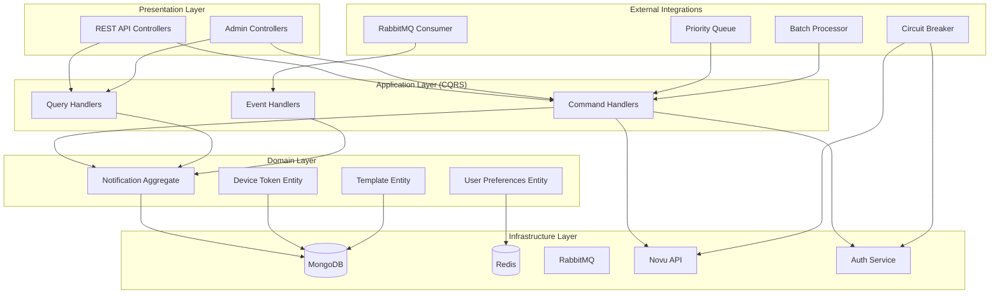

# Components

Based on architectural patterns, tech stack, and data models defined above, I have identified the main logical components of Notification Service. Each component is designed following DDD principles with clear boundaries and interfaces.

### Notification Core Component

**Responsibility:** Handle core business logic for notification processing, including domain logic, validation, and orchestration.

**Key Interfaces:**

- `SendNotificationCommand` - Command to send notification
- `ProcessNotificationEvent` - Event handler for RabbitMQ events
- `GetNotificationHistoryQuery` - Query to get notification history
- `MarkNotificationAsReadCommand` - Command to mark as read

**Dependencies:** DeviceToken Service, UserPreferences Service, Novu Integration, Auth Service Integration

**Technology Stack:** NestJS modules, DDD aggregates, CQRS handlers, Mongoose repositories

### Device Token Management Component

**Responsibility:** Manage device tokens for push notifications, including registration, validation, and cleanup. Support multiple push notification providers (FCM, APNS, Expo).

**Key Interfaces:**

- `RegisterDeviceTokenCommand` - Register new device token
- `UpdateDeviceTokenCommand` - Update device token
- `DeleteDeviceTokenCommand` - Delete device token
- `GetUserTokensQuery` - Get user tokens
- `MultiProviderTokenService` - Handle tokens for different providers

**Dependencies:** User Service, Novu Integration, Push Notification Providers

**Supported Providers:** FCM, APNS, Expo

**Technology Stack:** NestJS service, Mongoose schemas, validation pipes

### User Preferences Component

**Responsibility:** Manage user preferences for notification channels and types, supporting opt-out functionality.

**Key Interfaces:**

- `GetUserPreferencesQuery` - Get user preferences
- `UpdateUserPreferencesCommand` - Update preferences
- `ValidatePreferencesPolicy` - Validate business rules (emergency cannot be disabled)

**Dependencies:** User Service, Redis Cache

**Technology Stack:** NestJS service, Redis caching, business rules validation

### Notification Templates Component

**Responsibility:** Manage notification templates with variables and i18n support, render templates with dynamic content.

**Key Interfaces:**

- `CreateTemplateCommand` - Create new template
- `UpdateTemplateCommand` - Update template
- `RenderTemplateQuery` - Render template with variables
- `GetTemplatesByTypeQuery` - Get templates by type

**Dependencies:** Admin authorization, template validation

**Technology Stack:** Template engine, i18n support, HTML sanitization

### RabbitMQ Event Consumer Component

**Responsibility:** Consume events from RabbitMQ, validate event schema, and trigger notification processing. Handle user lifecycle events for synchronization.

**Key Interfaces:**

- `NotificationEventConsumer` - Main consumer service
- `EventValidationService` - Validate incoming events
- `EventRoutingService` - Route events to appropriate handlers
- `UserEventConsumer` - Handle user synchronization events
- `UserSyncService` - Synchronize user data based on events

**Dependencies:** RabbitMQ connection, Event validation schemas, User Service

**Event Types:**

- `NotificationEvent` - For general notifications
- `UserCreatedEvent` - New user registration
- `UserUpdatedEvent` - User profile updates
- `UserDeletedEvent` - User account deletion

**Error Handling:** Dead Letter Queue (DLQ) for failed event processing

**Technology Stack:** @nestjs/microservices, RabbitMQ client, JSON schema validation, Mongoose

### Novu Integration Component

**Responsibility:** Integrate with Novu self-hosted API, manage subscribers, and trigger workflows.

**Key Interfaces:**

- `NovuClientService` - Main Novu API client
- `SubscriberManagementService` - Sync users with Novu subscribers
- `WorkflowTriggerService` - Trigger Novu workflows
- `DeliveryStatusService` - Track delivery status

**Dependencies:** Novu API, Circuit breaker, Retry logic

**Technology Stack:** @novu/node SDK, Circuit breaker pattern, HTTP client

### Auth Service Integration Component

**Responsibility:** Integrate with Auth Service to validate users, roles, and permissions.

**Key Interfaces:**

- `AuthValidationService` - Validate JWT tokens
- `RoleQueryService` - Query users by role
- `UserSyncService` - Sync user data from Auth Service

**Dependencies:** Auth Service API, JWT validation, Redis cache

**Technology Stack:** HTTP client, JWT library, Redis caching

### Priority Queue System Component

**Responsibility:** Manage priority queue system with 5 parallel workers to process notifications by priority level. Implement Redis persistence for zero data loss.

**Key Interfaces:**

- `PriorityQueueService` - Main queue management
- `WorkerPoolService` - Manage worker pools
- `QueueMonitoringService` - Monitor queue metrics
- `RedisPersistenceService` - Backup queue state to Redis
- `QueueRecoveryService` - Restore queue state from Redis

**Dependencies:** RabbitMQ priority queues, Worker management, Redis

**Persistence Mechanism:** Redis (Tedis client, AOF/RDB for zero data loss)

**Technology Stack:** RabbitMQ priority queues, Worker threads, Monitoring, Redis

### Circuit Breaker Component

**Responsibility:** Implement circuit breaker pattern for external service calls to prevent cascading failures.

**Key Interfaces:**

- `CircuitBreakerService` - Main circuit breaker logic
- `HealthCheckService` - Monitor external service health
- `FallbackService` - Handle fallback scenarios

**Dependencies:** External service monitoring, Fallback mechanisms

**Technology Stack:** Circuit breaker library, Health check endpoints

### Batch Processing Component

**Responsibility:** Handle batch processing for high-volume notifications and deduplication.

**Key Interfaces:**

- `BatchProcessorService` - Main batch processing logic
- `DeduplicationService` - Prevent duplicate notifications
- `BatchOptimizationService` - Optimize batch operations

**Dependencies:** Database batch operations, Cache for deduplication

**Technology Stack:** MongoDB bulk operations, Redis for deduplication

### Admin Dashboard Component

**Responsibility:** Provide admin APIs for notification management, statistics, and broadcast functionality.

**Key Interfaces:**

- `NotificationStatisticsQuery` - Get notification statistics
- `BroadcastNotificationCommand` - Send broadcast notifications
- `FailedNotificationQuery` - Get failed notifications report
- `ManualRetryCommand` - Manual retry failed notifications

**Dependencies:** Admin authorization, Statistics aggregation

**Technology Stack:** NestJS controllers, Admin guards, Statistics queries

### Component Diagrams

---

