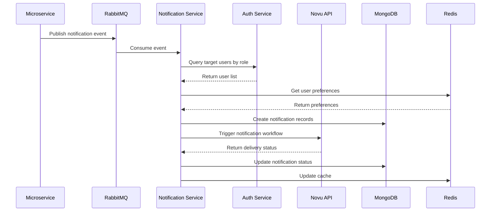
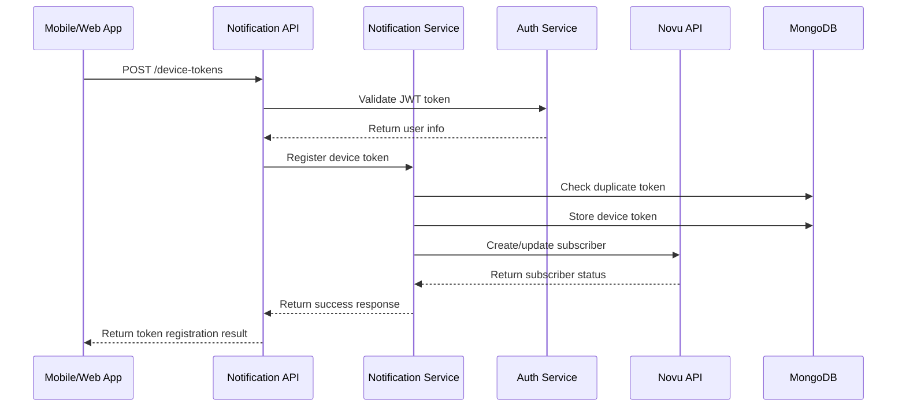
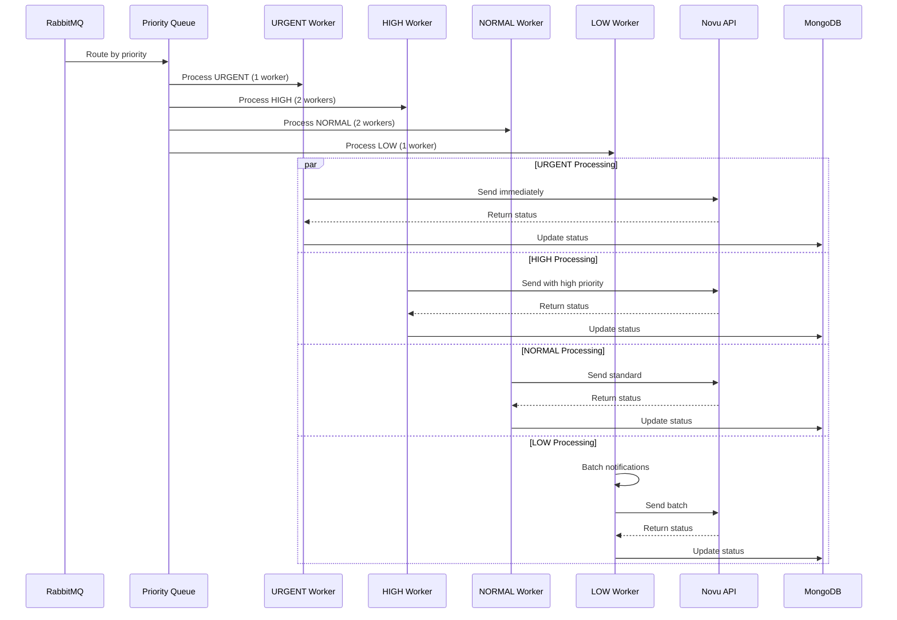
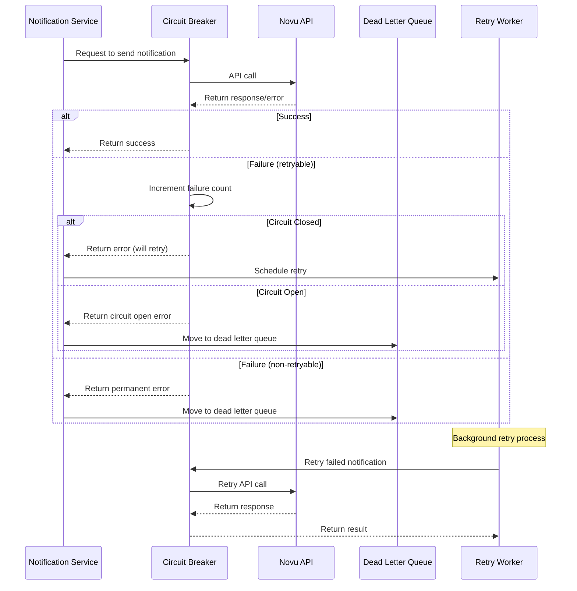
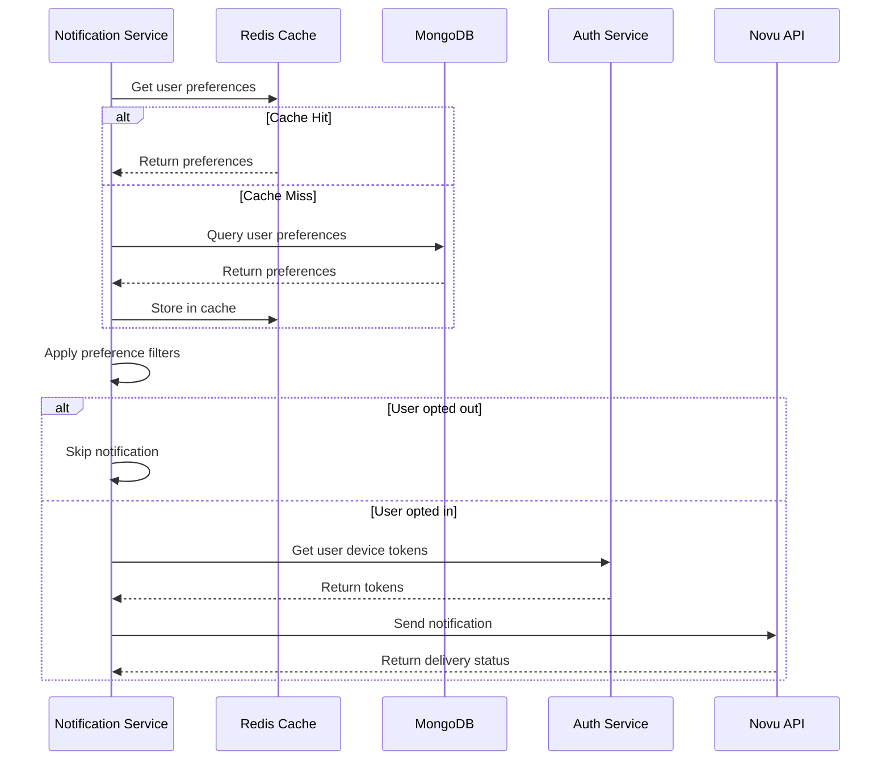
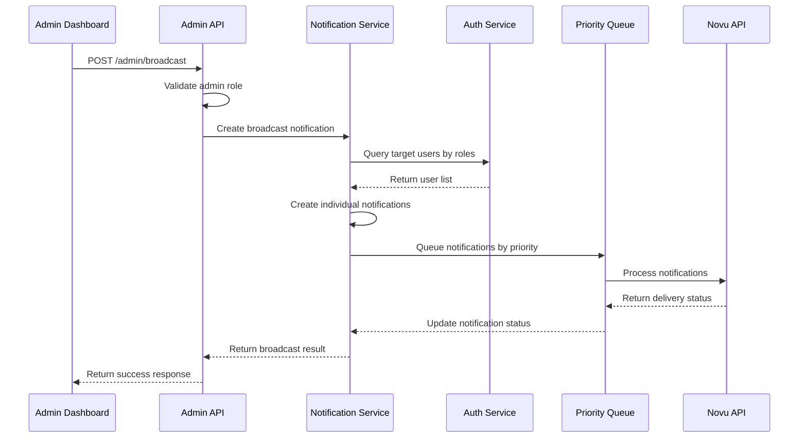

# Core Workflows

I will create sequence diagrams to illustrate the most important processing flows of Notification Service, including both high-level and detailed workflows.

### High-Level Notification Processing Workflow

### Device Token Registration Workflow

### Priority Queue Processing Workflow

### Circuit Breaker and Retry Workflow

### User Preferences and Targeting Workflow

### Admin Broadcast Workflow

---

