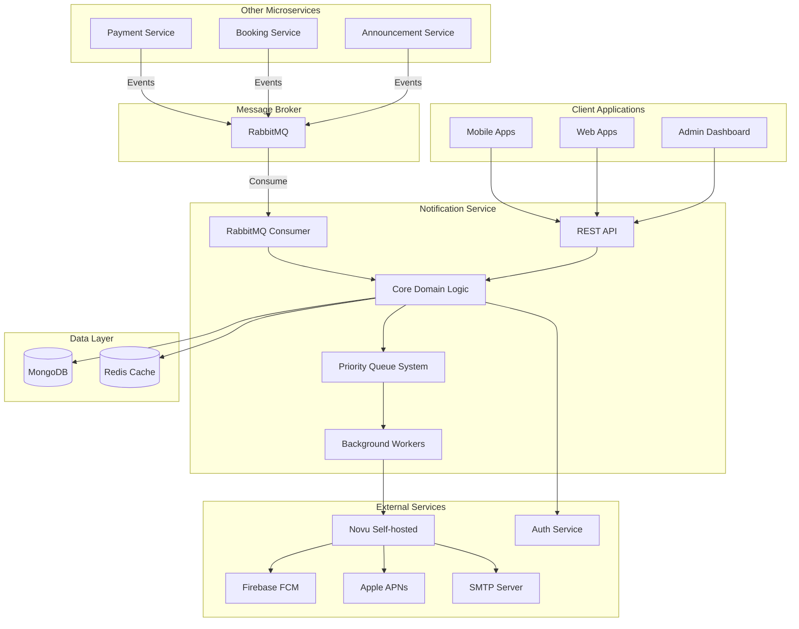

# High Level Architecture

### Technical Summary

Notification Service is designed as an **Event-Driven Microservice** using **Domain-Driven Design (DDD) + CQRS patterns**. The system uses **NestJS framework with Fastify adapter** and **MongoDB** with **RabbitMQ** to process notifications from internal microservices, integrating with **Novu self-hosted** to send push notifications, in-app notifications and email notifications. The architecture supports **priority queue system**, **circuit breaker pattern**, and **batch processing** to ensure high performance and reliability.

### High Level Overview

1. **Main Architecture**: Event-Driven Microservice with DDD + CQRS
2. **Repository Structure**: Monorepo (following existing system pattern)
3. **Service Architecture**: Independent microservice integrating with existing ecosystem
4. **Primary Interaction Flow**:
   - Receive events from RabbitMQ → Process business logic → Send via Novu → Store history
5. **Key Architectural Decisions**:
   - Event-driven for decoupling from other microservices
   - DDD + CQRS to manage notification domain complexity
   - Priority queue to process notifications by priority level
   - Circuit breaker to ensure resilience

### High Level Project Diagram

### Architectural and Design Patterns

- **Event-Driven Architecture:** Using RabbitMQ to receive events from microservices - _Rationale:_ Complete decoupling and enables async processing
- **Domain-Driven Design (DDD):** Organize code by domain boundaries - _Rationale:_ Manage notification domain complexity and easier maintenance
- **CQRS (Command Query Responsibility Segregation):** Separate read/write operations - _Rationale:_ Optimize performance for notification queries and commands
- **Repository Pattern:** Abstract data access logic - _Rationale:_ Easy testing and future database migration flexibility
- **Circuit Breaker Pattern:** Protect against external service failures - _Rationale:_ Ensure system resilience when Novu or Auth Service is down
- **Priority Queue Pattern:** Process notifications by priority level - _Rationale:_ Ensure urgent notifications are processed first
- **Batch Processing Pattern:** Process batches for high-volume notifications - _Rationale:_ Optimize performance and reduce API calls

---

