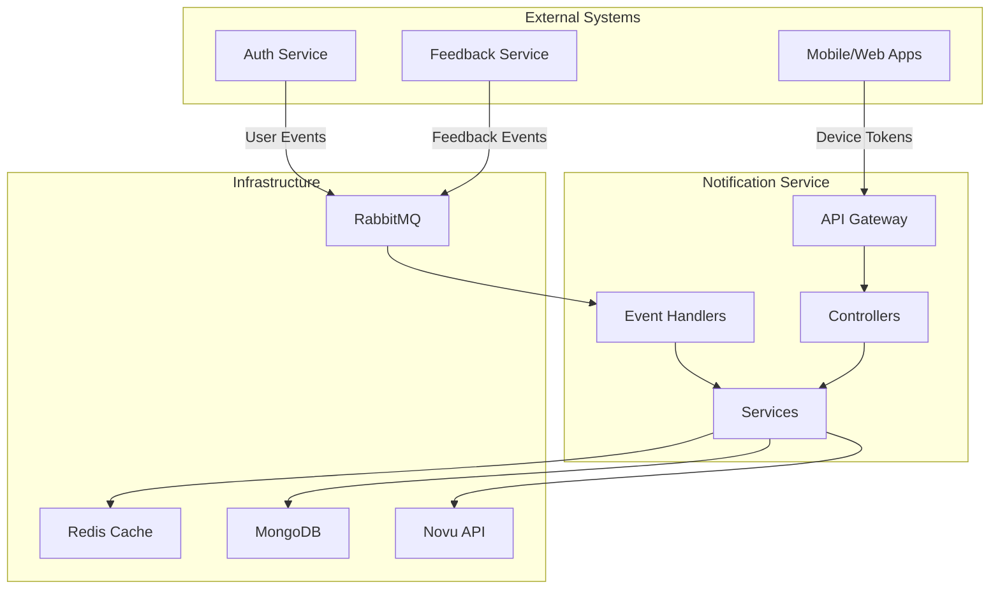
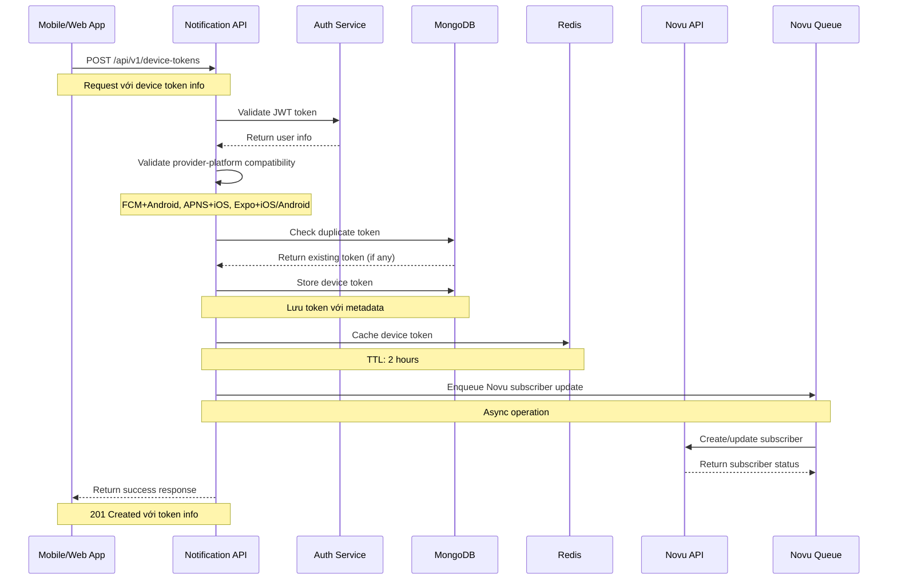
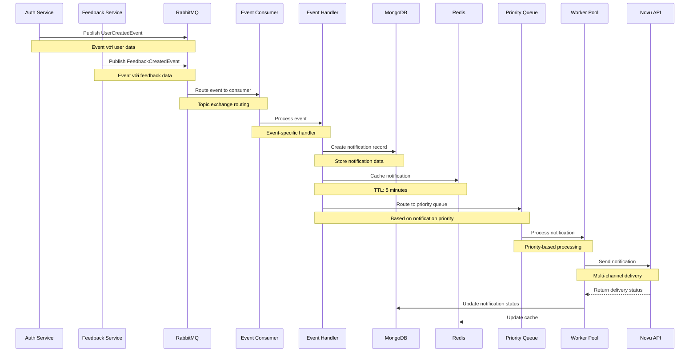
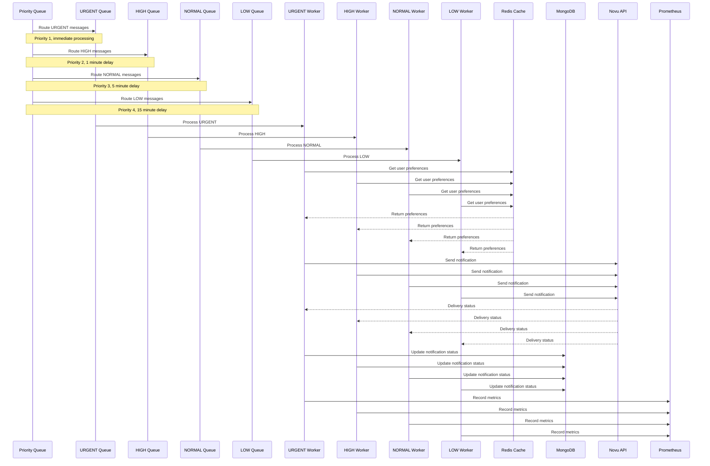
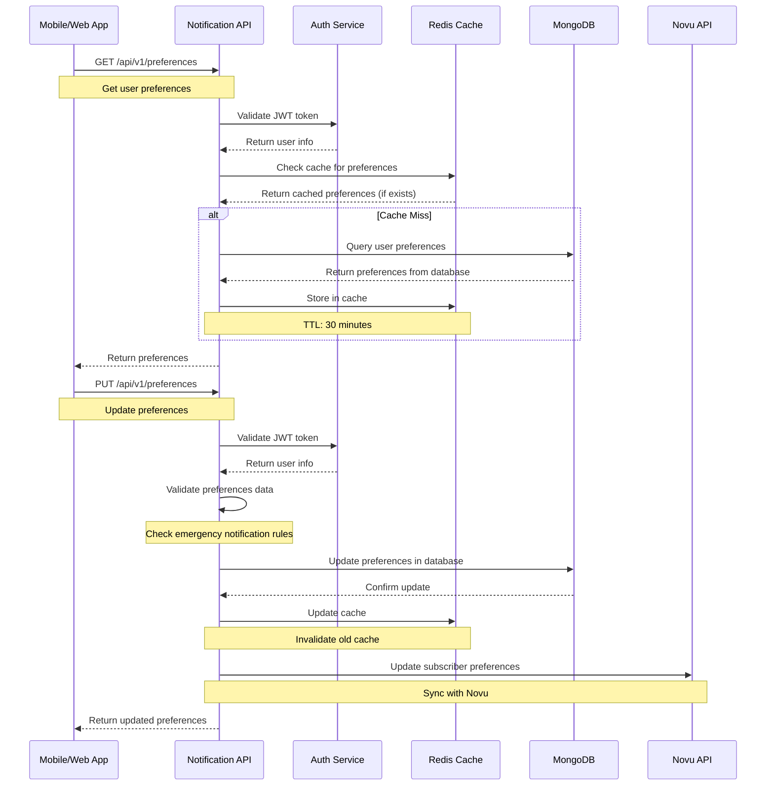
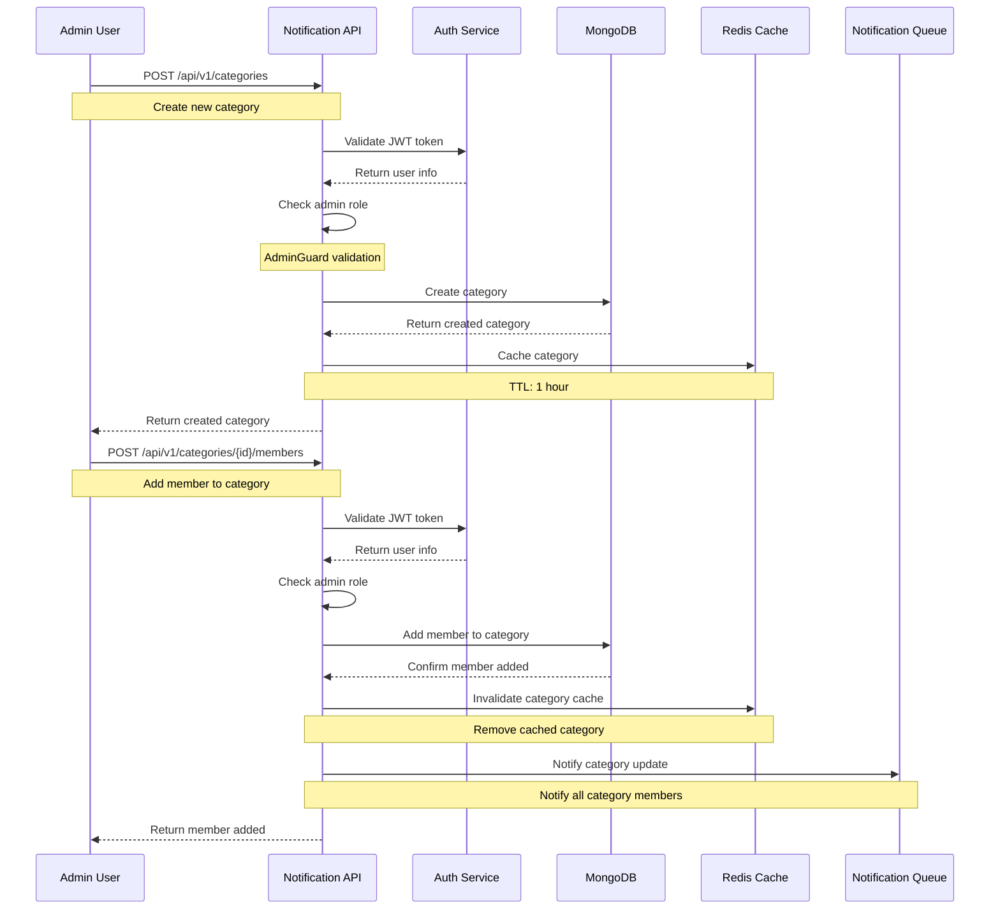
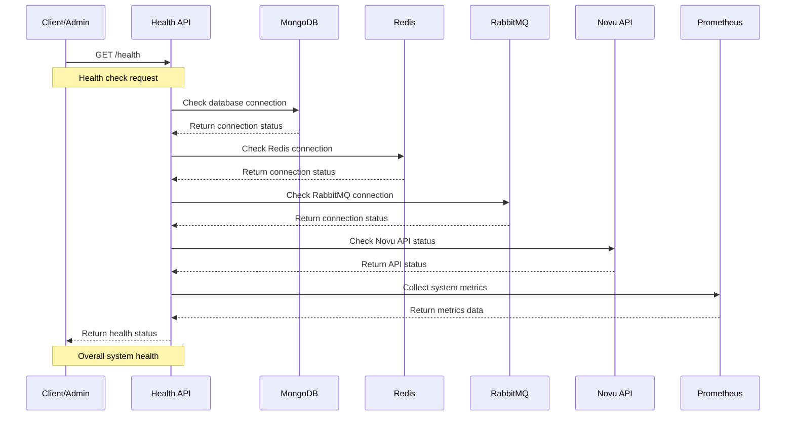
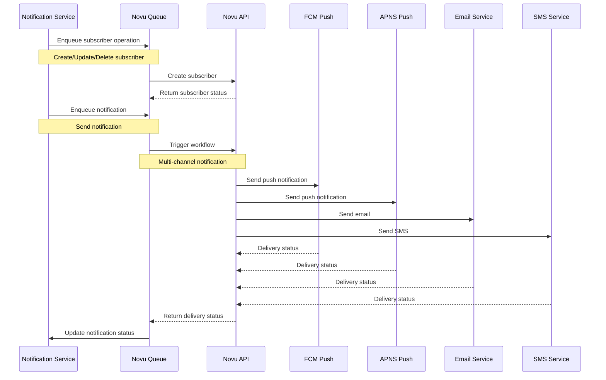
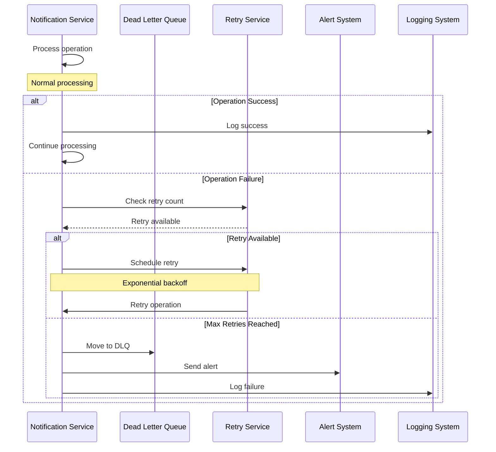

# Tài Liệu Tổng Hợp Luồng Hệ Thống - Notification Service

## Tổng Quan Hệ Thống

Hệ thống Notification Service là một microservice được xây dựng bằng NestJS, chuyên xử lý việc gửi thông báo đa kênh (push notification, email, in-app) thông qua tích hợp với Novu API. Hệ thống sử dụng kiến trúc event-driven với RabbitMQ, Redis cache, và MongoDB để lưu trữ dữ liệu.

## Kiến Trúc Tổng Thể



## 1. Luồng Đăng Ký Device Token

### Mục Đích

Đăng ký thiết bị để nhận push notification

### Luồng Xử Lý Chi Tiết



### API Endpoint

**POST** `/api/v1/device-tokens`

### Request Body

```json
{
  "token": "fcm_token_123456789abcdef",
  "platform": "android",
  "provider": "fcm",
  "deviceId": "device_123456",
  "deviceName": "Samsung Galaxy S21",
  "osVersion": "13",
  "appVersion": "1.2.3"
}
```

### Response

```json
{
  "id": "cuid_device_token_123",
  "userId": "user_123",
  "token": "fcm_token_123456789abcdef",
  "platform": "android",
  "provider": "fcm",
  "deviceId": "device_123456",
  "isActive": true,
  "lastUsedAt": null,
  "deviceName": "Samsung Galaxy S21",
  "osVersion": "13",
  "appVersion": "1.2.3",
  "createdAt": "2024-01-15T10:30:00Z",
  "updatedAt": "2024-01-15T10:30:00Z"
}
```

### Support Systems Hoạt Động

#### 1. MongoDB Database

- **Collection**: `device_tokens`
- **Indexes**:
  - `{ userId: 1, isActive: 1 }` - Compound index
  - `{ token: 1 }` - Unique index
  - `{ platform: 1, provider: 1 }` - Query optimization

#### 2. Redis Cache

- **Key Pattern**: `user:{userId}:device_tokens`
- **TTL**: 7200 seconds (2 hours)
- **Strategy**: Write-through cache

#### 3. Novu Integration

- **Queue**: `novu:subscriber:queue`
- **Operation**: Async subscriber update
- **Retry**: 5 attempts với exponential backoff

## 2. Luồng Xử Lý Event Từ RabbitMQ

### Mục Đích

Xử lý các event từ các service khác để tạo notification

### Luồng Xử Lý Chi Tiết



### Event Types và Handlers

#### 1. Auth Events

- `auth.UserCreatedEvent` → UserCreatedEventHandler
- `auth.UserUpdatedEvent` → UserUpdatedEventHandler
- `auth.UserRoleChangedEvent` → UserRoleChangedEventHandler
- `auth.UserDeletedEvent` → UserDeletedEventHandler

#### 2. Feedback Events

- `feedback.FeedbackCreatedEvent` → FeedbackCreatedEventHandler
- `feedback.StatusChangedEvent` → StatusChangedEventHandler
- `feedback.SLABreachedEvent` → SLABreachedEventHandler
- `feedback.CommentAddedEvent` → CommentAddedEventHandler

### Sample Event Data

```json
{
  "eventType": "auth.UserCreatedEvent",
  "timestamp": "2024-01-15T10:30:00Z",
  "payload": {
    "userData": {
      "userId": "user_123",
      "email": "user@example.com",
      "name": "John Doe",
      "phone": "+84123456789",
      "role": "RESIDENT",
      "apartment": "A101",
      "building": "Building A",
      "isActive": true
    }
  }
}
```

### Support Systems Hoạt Động

#### 1. RabbitMQ Message Queue

- **Exchange**: `notification.events` (Topic)
- **Routing Pattern**: `{service}.{eventType}`
- **Queues**:
  - `notification.urgent` (priority: 1, TTL: 0)
  - `notification.high` (priority: 2, TTL: 5min)
  - `notification.normal` (priority: 3, TTL: 15min)
  - `notification.low` (priority: 4, TTL: 30min)
  - `notification.dlq` (TTL: 24h)

#### 2. Event Processing

```typescript
// Event processing flow
async processEvent(event: BaseEventDto) {
  try {
    // 1. Validate event
    await this.validateEvent(event);

    // 2. Create notification record
    const notification = await this.createNotification(event);

    // 3. Cache notification
    await this.cacheNotification(notification);

    // 4. Route to priority queue
    await this.routeToPriorityQueue(notification);

    // 5. ACK message
    this.ackMessage(event);

  } catch (error) {
    // Handle failure
    await this.handleEventFailure(event, error);
  }
}
```

#### 3. MongoDB Operations

- **Collection**: `notifications`
- **Indexes**:
  - `{ status: 1, createdAt: -1 }`
  - `{ targetRoles: 1, status: 1 }`
  - `{ targetUsers: 1, status: 1 }`
  - `{ type: 1, priority: 1 }`

#### 4. Redis Cache

- **Key Pattern**: `notification:{notificationId}`
- **TTL**: 300 seconds (5 minutes)
- **Strategy**: Write-through cache

## 3. Luồng Xử Lý Priority Queue

### Mục Đích

Xử lý notification theo mức độ ưu tiên

### Luồng Xử Lý Chi Tiết



### Priority Levels và Processing

#### 1. URGENT (Priority 1)

- **Processing Time**: Immediate
- **TTL**: No expiration
- **Workers**: 2 concurrent workers
- **Use Cases**: Emergency alerts, system failures

#### 2. HIGH (Priority 2)

- **Processing Time**: Within 1 minute
- **TTL**: 5 minutes
- **Workers**: 3 concurrent workers
- **Use Cases**: Important updates, security alerts

#### 3. NORMAL (Priority 3)

- **Processing Time**: Within 5 minutes
- **TTL**: 15 minutes
- **Workers**: 5 concurrent workers
- **Use Cases**: Regular notifications, announcements

#### 4. LOW (Priority 4)

- **Processing Time**: Within 15 minutes
- **TTL**: 30 minutes
- **Workers**: 3 concurrent workers
- **Use Cases**: Marketing messages, reminders

### Sample Priority Message

```json
{
  "id": "msg_123",
  "userId": "user_123",
  "type": "emergency",
  "priority": "urgent",
  "title": "Emergency Alert",
  "body": "Fire alarm activated in building",
  "channels": ["push", "email"],
  "data": {
    "building": "Building A",
    "floor": "1",
    "timestamp": "2024-01-15T10:30:00Z"
  }
}
```

### Support Systems Hoạt Động

#### 1. RabbitMQ Priority Queues

```typescript
// Queue configuration
const queueConfig = {
  urgent: {
    name: 'notification.urgent',
    priority: 1,
    ttl: 0,
    workers: 2,
  },
  high: {
    name: 'notification.high',
    priority: 2,
    ttl: 300000, // 5 minutes
    workers: 3,
  },
  normal: {
    name: 'notification.normal',
    priority: 3,
    ttl: 900000, // 15 minutes
    workers: 5,
  },
  low: {
    name: 'notification.low',
    priority: 4,
    ttl: 1800000, // 30 minutes
    workers: 3,
  },
};
```

#### 2. Worker Pool Management

```typescript
// Worker pool implementation
class WorkerPool {
  private workers: Map<string, Worker[]> = new Map();

  async startWorkers() {
    for (const [queueType, config] of Object.entries(queueConfig)) {
      const workers = [];
      for (let i = 0; i < config.workers; i++) {
        const worker = new Worker(queueType, config);
        await worker.start();
        workers.push(worker);
      }
      this.workers.set(queueType, workers);
    }
  }

  async processMessage(queueType: string, message: any) {
    const workers = this.workers.get(queueType);
    const worker = this.getNextWorker(workers);
    await worker.process(message);
  }
}
```

#### 3. Redis Cache Integration

- **Key Pattern**: `notification:{notificationId}`
- **TTL**: Based on priority (urgent: 1h, high: 30min, normal: 15min, low: 5min)
- **Strategy**: Write-through cache

#### 4. Prometheus Metrics

```typescript
// Metrics collection
class MetricsService {
  private readonly notificationSent = new Counter({
    name: 'notification_sent_total',
    help: 'Total number of notifications sent',
    labelNames: ['channel', 'type', 'status', 'priority'],
  });

  private readonly messageProcessingDuration = new Histogram({
    name: 'message_processing_duration_seconds',
    help: 'Time spent processing messages',
    labelNames: ['queue', 'type', 'priority'],
  });

  recordNotificationSent(channel: string, type: string, status: string, priority: string) {
    this.notificationSent.inc({ channel, type, status, priority });
  }
}
```

## 4. Luồng Quản Lý User Preferences

### Mục Đích

Cho phép user cấu hình preferences nhận notification

### Luồng Xử Lý Chi Tiết



### API Endpoints

#### 1. Get User Preferences

**GET** `/api/v1/preferences`

**Response**:

```json
{
  "success": true,
  "message": "Preferences retrieved successfully",
  "data": {
    "id": "pref_123",
    "userId": "user_123",
    "channelPreferences": {
      "push": true,
      "email": true,
      "inApp": false
    },
    "typePreferences": {
      "payment": true,
      "booking": true,
      "announcement": false,
      "emergency": true
    },
    "quietHours": {
      "enabled": true,
      "startTime": "22:00",
      "endTime": "07:00",
      "timezone": "Asia/Ho_Chi_Minh"
    },
    "createdAt": "2024-01-15T10:30:00Z",
    "updatedAt": "2024-01-15T10:30:00Z"
  },
  "timestamp": "2024-01-15T10:30:00Z"
}
```

#### 2. Update User Preferences

**PUT** `/api/v1/preferences`

**Request Body**:

```json
{
  "channels": {
    "push": true,
    "email": false,
    "inApp": true
  },
  "types": {
    "payment": true,
    "booking": false,
    "announcement": true,
    "emergency": true
  },
  "quietHours": {
    "enabled": true,
    "startTime": "23:00",
    "endTime": "08:00",
    "timezone": "Asia/Ho_Chi_Minh"
  }
}
```

**Response**:

```json
{
  "success": true,
  "message": "Preferences updated successfully",
  "data": {
    "id": "pref_123",
    "userId": "user_123",
    "channelPreferences": {
      "push": true,
      "email": false,
      "inApp": true
    },
    "typePreferences": {
      "payment": true,
      "booking": false,
      "announcement": true,
      "emergency": true
    },
    "quietHours": {
      "enabled": true,
      "startTime": "23:00",
      "endTime": "08:00",
      "timezone": "Asia/Ho_Chi_Minh"
    },
    "createdAt": "2024-01-15T10:30:00Z",
    "updatedAt": "2024-01-15T11:15:00Z"
  },
  "timestamp": "2024-01-15T11:15:00Z"
}
```

### Support Systems Hoạt Động

#### 1. MongoDB Database

- **Collection**: `user_preferences`
- **Indexes**:
  - `{ userId: 1 }` - Unique index
  - `{ updatedAt: -1 }` - Query optimization

#### 2. Redis Cache

- **Key Pattern**: `user:{userId}:preferences`
- **TTL**: 1800 seconds (30 minutes)
- **Strategy**: Cache-aside pattern

#### 3. Novu Integration

- **Operation**: Update subscriber preferences
- **Queue**: `novu:subscriber:queue`
- **Retry**: 3 attempts với exponential backoff

## 5. Luồng Quản Lý Categories

### Mục Đích

Quản lý các danh mục notification và thành viên (Admin only)

### Luồng Xử Lý Chi Tiết



### API Endpoints

#### 1. Create Category (Admin Only)

**POST** `/api/v1/categories`

**Request Body**:

```json
{
  "name": "Emergency Alerts",
  "description": "Critical notifications for emergency situations",
  "parentId": null,
  "metadata": {
    "icon": "alert-triangle",
    "color": "#ff4444",
    "priority": 1,
    "tags": ["emergency", "safety", "critical"]
  }
}
```

**Response**:

```json
{
  "success": true,
  "data": {
    "id": "cat_123",
    "name": "Emergency Alerts",
    "description": "Critical notifications for emergency situations",
    "parentId": null,
    "metadata": {
      "icon": "alert-triangle",
      "color": "#ff4444",
      "priority": 1,
      "tags": ["emergency", "safety", "critical"]
    },
    "isActive": true,
    "memberCount": 0,
    "createdBy": "admin_123",
    "createdAt": "2024-01-15T10:30:00Z",
    "updatedAt": "2024-01-15T10:30:00Z"
  },
  "timestamp": "2024-01-15T10:30:00Z"
}
```

#### 2. Get Categories

**GET** `/api/v1/categories`

**Query Parameters**:

- `search`: "emergency"
- `isActive`: true
- `page`: 1
- `limit`: 10
- `sortBy`: "name"
- `sortOrder`: "asc"

**Response**:

```json
{
  "success": true,
  "data": {
    "categories": [
      {
        "id": "cat_123",
        "name": "Emergency Alerts",
        "description": "Critical notifications for emergency situations",
        "parentId": null,
        "metadata": {
          "icon": "alert-triangle",
          "color": "#ff4444",
          "priority": 1,
          "tags": ["emergency", "safety", "critical"]
        },
        "isActive": true,
        "memberCount": 5,
        "createdBy": "admin_123",
        "createdAt": "2024-01-15T10:30:00Z",
        "updatedAt": "2024-01-15T10:30:00Z"
      }
    ],
    "pagination": {
      "page": 1,
      "limit": 10,
      "total": 1,
      "totalPages": 1
    }
  },
  "timestamp": "2024-01-15T10:30:00Z"
}
```

#### 3. Add Member to Category

**POST** `/api/v1/categories/{categoryId}/members`

**Request Body**:

```json
{
  "userId": "user_123",
  "role": "member",
  "permissions": {
    "canReceiveNotifications": true,
    "canManageMembers": false
  }
}
```

**Response**:

```json
{
  "success": true,
  "data": {
    "id": "member_123",
    "categoryId": "cat_123",
    "userId": "user_123",
    "role": "member",
    "permissions": {
      "canReceiveNotifications": true,
      "canManageMembers": false
    },
    "joinedAt": "2024-01-15T10:30:00Z",
    "isActive": true
  },
  "timestamp": "2024-01-15T10:30:00Z"
}
```

### Support Systems Hoạt Động

#### 1. MongoDB Database

- **Collections**:
  - `categories` - Category information
  - `category_members` - Category membership
- **Indexes**:
  - `{ name: 1 }` - Category name search
  - `{ isActive: 1, createdAt: -1 }` - Active categories
  - `{ categoryId: 1, userId: 1 }` - Member lookup

#### 2. Redis Cache

- **Key Patterns**:
  - `category:{categoryId}` - Category data
  - `category:{categoryId}:members` - Category members
- **TTL**: 3600 seconds (1 hour)
- **Strategy**: Write-through cache

#### 3. Notification Queue

- **Operation**: Notify category members of updates
- **Priority**: Based on category priority
- **Channels**: Based on member preferences

## 6. Luồng Health Check và Monitoring

### Mục Đích

Kiểm tra sức khỏe của hệ thống và các dependencies

### Luồng Xử Lý Chi Tiết



### API Endpoint

**GET** `/health`

### Response

```json
{
  "status": "ok",
  "info": {
    "database": {
      "status": "up",
      "responseTime": "15ms",
      "connectionPool": {
        "active": 5,
        "idle": 3,
        "total": 8
      }
    },
    "redis": {
      "status": "up",
      "responseTime": "2ms",
      "memory": {
        "used": "128MB",
        "max": "2GB"
      }
    },
    "rabbitmq": {
      "status": "up",
      "responseTime": "8ms",
      "queues": {
        "urgent": 0,
        "high": 2,
        "normal": 5,
        "low": 1
      }
    },
    "novu": {
      "status": "up",
      "responseTime": "120ms",
      "apiVersion": "v1.0.0"
    }
  },
  "error": {},
  "details": {
    "database": {
      "status": "up",
      "responseTime": "15ms"
    },
    "redis": {
      "status": "up",
      "responseTime": "2ms"
    },
    "rabbitmq": {
      "status": "up",
      "responseTime": "8ms"
    },
    "novu": {
      "status": "up",
      "responseTime": "120ms"
    }
  }
}
```

### Support Systems Hoạt Động

#### 1. Health Check Implementation

```typescript
// Health check service
class HealthService {
  async checkDatabase(): Promise<HealthIndicatorResult> {
    const startTime = Date.now();
    try {
      await this.mongoService.ping();
      return {
        status: 'up',
        responseTime: Date.now() - startTime,
        connectionPool: await this.getConnectionPoolStatus(),
      };
    } catch (error) {
      return { status: 'down', error: error.message };
    }
  }

  async checkRedis(): Promise<HealthIndicatorResult> {
    const startTime = Date.now();
    try {
      await this.redisService.ping();
      return {
        status: 'up',
        responseTime: Date.now() - startTime,
        memory: await this.getRedisMemoryInfo(),
      };
    } catch (error) {
      return { status: 'down', error: error.message };
    }
  }
}
```

#### 2. Prometheus Metrics

```typescript
// Metrics collection
class MetricsService {
  private readonly healthCheckDuration = new Histogram({
    name: 'health_check_duration_seconds',
    help: 'Time spent on health checks',
    labelNames: ['service'],
  });

  private readonly systemStatus = new Gauge({
    name: 'system_status',
    help: 'System component status',
    labelNames: ['component'],
  });

  recordHealthCheck(service: string, duration: number, status: string) {
    this.healthCheckDuration.observe({ service }, duration);
    this.systemStatus.set({ component: service }, status === 'up' ? 1 : 0);
  }
}
```

## 7. Luồng Novu Integration

### Mục Đích

Tích hợp với Novu API để gửi notification đa kênh

### Luồng Xử Lý Chi Tiết



### Novu Operations

#### 1. Subscriber Management

```typescript
// Subscriber operations
class NovuSubscriberService {
  async createSubscriber(userData: {
    userId: string;
    email: string;
    phone?: string;
    name: string;
    role: string;
  }) {
    const subscriber = {
      subscriberId: userData.userId,
      email: userData.email,
      phone: userData.phone,
      firstName: userData.name.split(' ')[0],
      lastName: userData.name.split(' ').slice(1).join(' '),
      data: {
        roles: [userData.role],
        apartment: userData.apartment,
        building: userData.building,
        isActive: userData.isActive,
      },
    };

    return await this.novuClient.subscribers.identify(subscriber);
  }
}
```

#### 2. Workflow Triggering

```typescript
// Workflow trigger service
class NovuWorkflowService {
  async triggerNotification(workflowId: string, recipients: string[], payload: any) {
    const trigger = {
      name: workflowId,
      to: recipients.map((recipient) => ({ subscriberId: recipient })),
      payload: {
        title: payload.title,
        body: payload.body,
        data: payload.data,
        channels: payload.channels,
      },
    };

    return await this.novuClient.trigger(trigger);
  }
}
```

### Support Systems Hoạt Động

#### 1. Novu Queue Service

```typescript
// Queue service for Novu operations
class NovuQueueService {
  async enqueueSubscriberOperation(operation: {
    type: 'create' | 'update' | 'delete';
    userId: string;
    data: any;
  }) {
    const task = {
      id: generateId(),
      type: operation.type,
      userId: operation.userId,
      data: operation.data,
      attempts: 0,
      maxAttempts: 5,
      createdAt: new Date().toISOString(),
    };

    // Store in Redis queue
    await this.redisService.lpush('novu:subscriber:queue', JSON.stringify(task));

    // Process queue
    this.processQueue();
  }
}
```

#### 2. Circuit Breaker Pattern

```typescript
// Circuit breaker for Novu API
class NovuCircuitBreaker {
  private failureCount = 0;
  private readonly threshold = 5;
  private readonly resetTimeout = 60000; // 1 minute
  private circuitOpen = false;

  async execute<T>(operation: () => Promise<T>): Promise<T> {
    if (this.circuitOpen) {
      throw new Error('Circuit breaker is open');
    }

    try {
      const result = await operation();
      this.resetFailureCount();
      return result;
    } catch (error) {
      this.incrementFailureCount();
      throw error;
    }
  }
}
```

## 8. Luồng Error Handling và Retry

### Mục Đích

Xử lý lỗi và retry mechanism cho tất cả operations

### Luồng Xử Lý Chi Tiết



### Retry Configuration

```typescript
// Retry configuration
const retryConfig = {
  maxAttempts: 3,
  baseDelay: 1000, // 1 second
  maxDelay: 30000, // 30 seconds
  backoffMultiplier: 2,
  jitter: true,
};

// Retry implementation
class RetryService {
  async executeWithRetry<T>(
    operation: () => Promise<T>,
    config: RetryConfig = retryConfig,
  ): Promise<T> {
    let lastError: Error;

    for (let attempt = 1; attempt <= config.maxAttempts; attempt++) {
      try {
        return await operation();
      } catch (error) {
        lastError = error;

        if (attempt === config.maxAttempts) {
          throw error;
        }

        const delay = this.calculateDelay(attempt, config);
        await this.sleep(delay);
      }
    }

    throw lastError;
  }
}
```

### Support Systems Hoạt Động

#### 1. Dead Letter Queue

```typescript
// DLQ processing
class DLQService {
  async processDLQ() {
    const dlqMessages = await this.getDLQMessages();

    for (const message of dlqMessages) {
      if (message.retryCount < message.maxRetries) {
        // Retry with exponential backoff
        const delay = Math.pow(2, message.retryCount) * 1000;
        setTimeout(() => {
          this.retryMessage(message);
        }, delay);
      } else {
        // Move to permanent failure queue
        await this.moveToPermanentFailure(message);
      }
    }
  }
}
```

#### 2. Alert System

```typescript
// Alert system
class AlertService {
  async sendAlert(alert: { type: 'error' | 'warning' | 'info'; message: string; context: any }) {
    // Send to monitoring system
    await this.monitoringService.sendAlert(alert);

    // Send to Slack/Teams
    await this.notificationService.sendSlackMessage(alert);

    // Send email to admin
    await this.emailService.sendAdminAlert(alert);
  }
}
```

## 9. Luồng Performance Optimization

### Mục Đích

Tối ưu hóa hiệu suất hệ thống

### Caching Strategy

#### 1. Multi-Level Caching

```typescript
// Multi-level cache implementation
class CacheService {
  private l1Cache = new Map(); // In-memory cache
  private l2Cache: RedisService; // Redis cache
  private l3Cache: DatabaseService; // Database

  async get(key: string): Promise<any> {
    // L1 Cache
    if (this.l1Cache.has(key)) {
      return this.l1Cache.get(key);
    }

    // L2 Cache
    const l2Value = await this.l2Cache.get(key);
    if (l2Value) {
      this.l1Cache.set(key, l2Value);
      return l2Value;
    }

    // L3 Cache (Database)
    const l3Value = await this.l3Cache.get(key);
    if (l3Value) {
      this.l2Cache.set(key, l3Value, { ttl: 3600 });
      this.l1Cache.set(key, l3Value);
      return l3Value;
    }

    return null;
  }
}
```

#### 2. Connection Pooling

```typescript
// Connection pool configuration
const poolConfig = {
  // MongoDB connection pool
  mongo: {
    maxPoolSize: 20,
    minPoolSize: 5,
    maxIdleTimeMS: 30000,
  },

  // Redis connection pool
  redis: {
    maxRetriesPerRequest: 3,
    retryDelayOnFailover: 100,
    lazyConnect: true,
  },

  // RabbitMQ connection pool
  rabbitmq: {
    maxChannels: 50,
    heartbeat: 60,
    connectionTimeout: 30000,
  },
};
```

### Load Balancing

#### 1. Queue Load Balancing

```typescript
// Queue load balancer
class QueueLoadBalancer {
  private workers: Worker[] = [];
  private currentWorker = 0;

  addWorker(worker: Worker) {
    this.workers.push(worker);
  }

  getNextWorker(): Worker {
    const worker = this.workers[this.currentWorker];
    this.currentWorker = (this.currentWorker + 1) % this.workers.length;
    return worker;
  }

  distributeMessage(message: any) {
    const worker = this.getNextWorker();
    worker.process(message);
  }
}
```

## 10. Luồng Security và Compliance

### Mục Đích

Đảm bảo bảo mật và tuân thủ quy định

### Data Encryption

#### 1. At-Rest Encryption

```typescript
// Database encryption
const encryptionConfig = {
  algorithm: 'aes-256-gcm',
  key: process.env.ENCRYPTION_KEY,

  encrypt(data: any): string {
    const cipher = crypto.createCipher(encryptionConfig.algorithm, encryptionConfig.key);
    let encrypted = cipher.update(JSON.stringify(data), 'utf8', 'hex');
    encrypted += cipher.final('hex');
    return encrypted;
  },

  decrypt(encryptedData: string): any {
    const decipher = crypto.createDecipher(encryptionConfig.algorithm, encryptionConfig.key);
    let decrypted = decipher.update(encryptedData, 'hex', 'utf8');
    decrypted += decipher.final('utf8');
    return JSON.parse(decrypted);
  },
};
```

#### 2. In-Transit Encryption

```typescript
// TLS configuration
const tlsConfig = {
  // MongoDB TLS
  mongo: {
    ssl: true,
    sslValidate: true,
    sslCA: process.env.MONGO_SSL_CA,
    sslCert: process.env.MONGO_SSL_CERT,
    sslKey: process.env.MONGO_SSL_KEY,
  },

  // Redis TLS
  redis: {
    tls: {
      rejectUnauthorized: true,
      ca: process.env.REDIS_SSL_CA,
    },
  },

  // RabbitMQ TLS
  rabbitmq: {
    protocol: 'amqps',
    ca: process.env.RABBITMQ_SSL_CA,
    cert: process.env.RABBITMQ_SSL_CERT,
    key: process.env.RABBITMQ_SSL_KEY,
  },
};
```

### Audit Logging

#### 1. Audit Trail

```typescript
// Audit logging service
class AuditService {
  async logOperation(operation: {
    userId: string;
    action: string;
    resource: string;
    resourceId: string;
    changes?: any;
    metadata?: any;
  }) {
    const auditLog = {
      id: generateId(),
      userId: operation.userId,
      action: operation.action,
      resource: operation.resource,
      resourceId: operation.resourceId,
      changes: operation.changes,
      metadata: operation.metadata,
      timestamp: new Date().toISOString(),
      ipAddress: this.getClientIP(),
      userAgent: this.getUserAgent(),
    };

    await this.auditRepository.create(auditLog);
  }
}
```

## Kết Luận

Tài liệu này cung cấp cái nhìn tổng quan về tất cả các luồng chính trong hệ thống Notification Service, bao gồm:

1. **Luồng đăng ký Device Token** - Với validation, caching và Novu integration
2. **Luồng xử lý Event** - Với RabbitMQ routing và priority handling
3. **Luồng Priority Queue** - Với worker pools và metrics collection
4. **Luồng User Preferences** - Với caching và Novu sync
5. **Luồng Category Management** - Với admin controls và member management
6. **Luồng Health Check** - Với comprehensive monitoring
7. **Luồng Novu Integration** - Với circuit breaker và retry mechanisms
8. **Luồng Error Handling** - Với DLQ và alert systems
9. **Luồng Performance Optimization** - Với multi-level caching và load balancing
10. **Luồng Security** - Với encryption và audit logging

Mỗi luồng đều được mô tả chi tiết với:

- **API endpoints** và sample data
- **Support systems** hoạt động như thế nào
- **Code examples** cho implementation
- **Monitoring và metrics** collection
- **Error handling** và retry mechanisms

Tất cả được tích hợp trong một tài liệu duy nhất để dễ đọc và tham khảo.
