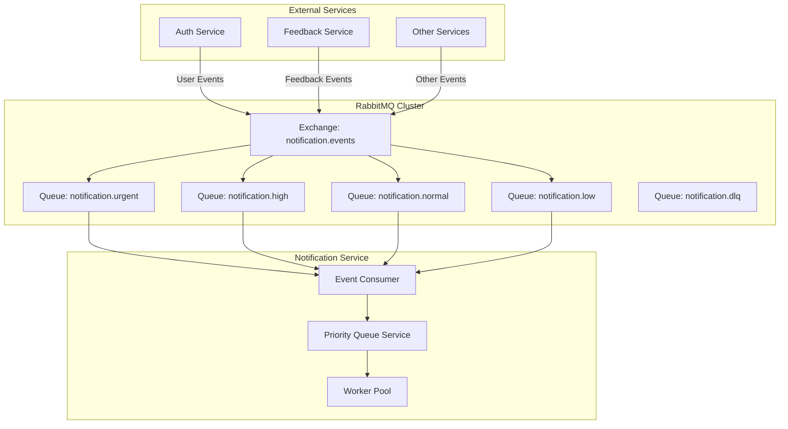
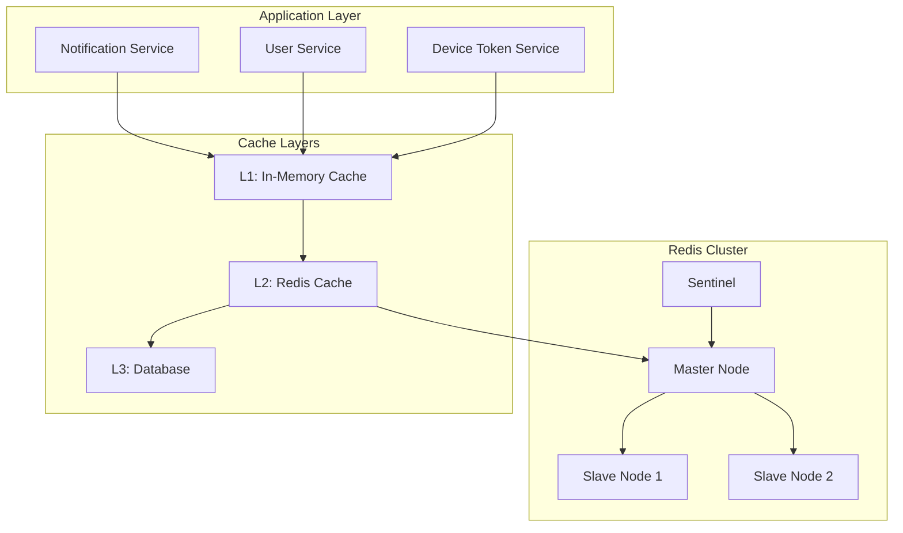
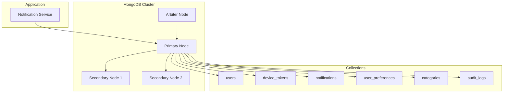
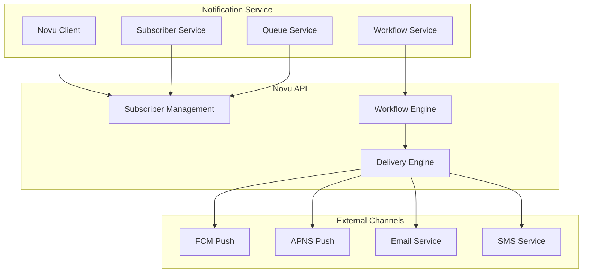

# Tài Liệu Các Hệ Thống Hỗ Trợ - Notification Service

## Tổng Quan

Hệ thống Notification Service sử dụng nhiều hệ thống hỗ trợ để đảm bảo hiệu suất, độ tin cậy và khả năng mở rộng. Tài liệu này mô tả chi tiết cách các hệ thống hỗ trợ hoạt động và tương tác với nhau.

## 1. RabbitMQ Message Queue System

### Kiến Trúc RabbitMQ



### Cấu Hình RabbitMQ

#### Exchanges

- **notification.events**: Topic exchange cho tất cả notification events
- **routing.pattern**: `{service}.{eventType}` (ví dụ: `auth.UserCreatedEvent`)

#### Queues và Routing

```yaml
Queues:
  - notification.urgent:
      routing_key: '*.urgent.*'
      priority: 1
      ttl: 0 (no expiration)

  - notification.high:
      routing_key: '*.high.*'
      priority: 2
      ttl: 300000 (5 minutes)

  - notification.normal:
      routing_key: '*.normal.*'
      priority: 3
      ttl: 900000 (15 minutes)

  - notification.low:
      routing_key: '*.low.*'
      priority: 4
      ttl: 1800000 (30 minutes)

  - notification.dlq:
      routing_key: '*.failed.*'
      ttl: 86400000 (24 hours)
```

#### Connection Management

```typescript
// Connection configuration
const connectionConfig = {
  hostname: process.env.RABBITMQ_HOST,
  port: parseInt(process.env.RABBITMQ_PORT),
  username: process.env.RABBITMQ_USERNAME,
  password: process.env.RABBITMQ_PASSWORD,
  vhost: process.env.RABBITMQ_VHOST || '/',

  // Connection settings
  heartbeat: 60,
  connectionTimeout: 30000,

  // Retry settings
  retryAttempts: 5,
  retryDelay: 1000,

  // Channel settings
  channelMax: 100,
  frameMax: 0x10000,
};
```

### Luồng Xử Lý Message

#### 1. Message Publishing

```typescript
// Event publishing flow
async publishEvent(eventType: string, payload: any, priority: string) {
  const message = {
    id: generateId(),
    eventType,
    timestamp: new Date().toISOString(),
    priority,
    payload,
    retryCount: 0,
    maxRetries: 3
  };

  const routingKey = `${eventType}.${priority}`;
  await this.channel.publish('notification.events', routingKey,
    Buffer.from(JSON.stringify(message)), {
      persistent: true,
      priority: this.getPriorityLevel(priority),
      expiration: this.getTTL(priority)
    });
}
```

#### 2. Message Consuming

```typescript
// Message consumption with error handling
async consumeMessage(channel: amqp.Channel, msg: amqp.ConsumeMessage) {
  try {
    const message = JSON.parse(msg.content.toString());

    // Process message
    await this.processEvent(message);

    // Acknowledge successful processing
    channel.ack(msg);

  } catch (error) {
    // Handle processing failure
    await this.handleMessageFailure(channel, msg, error);
  }
}
```

#### 3. Dead Letter Queue Handling

```typescript
// DLQ processing
async processDLQ() {
  const dlqMessages = await this.getDLQMessages();

  for (const message of dlqMessages) {
    if (message.retryCount < message.maxRetries) {
      // Retry with exponential backoff
      const delay = Math.pow(2, message.retryCount) * 1000;
      setTimeout(() => {
        this.retryMessage(message);
      }, delay);
    } else {
      // Move to permanent failure queue
      await this.moveToPermanentFailure(message);
    }
  }
}
```

## 2. Redis Cache System

### Kiến Trúc Redis



### Cấu Hình Redis

#### Connection Pool

```typescript
const redisConfig = {
  host: process.env.REDIS_HOST,
  port: parseInt(process.env.REDIS_PORT),
  password: process.env.REDIS_PASSWORD,

  // Connection pool
  maxRetriesPerRequest: 3,
  retryDelayOnFailover: 100,
  enableReadyCheck: false,
  maxRetriesPerRequest: null,

  // Cluster configuration
  enableOfflineQueue: false,
  lazyConnect: true,

  // Memory optimization
  maxmemory: '2gb',
  maxmemoryPolicy: 'allkeys-lru',
};
```

#### Cache Keys Structure

```typescript
// Cache key patterns
const CacheKeys = {
  // User data
  USER: (userId: string) => `user:${userId}`,
  USER_PREFERENCES: (userId: string) => `user:${userId}:preferences`,
  USER_DEVICE_TOKENS: (userId: string) => `user:${userId}:device_tokens`,

  // Notification data
  NOTIFICATION: (notificationId: string) => `notification:${notificationId}`,
  NOTIFICATION_TEMPLATE: (templateId: string) => `template:${templateId}`,

  // Category data
  CATEGORY: (categoryId: string) => `category:${categoryId}`,
  CATEGORY_MEMBERS: (categoryId: string) => `category:${categoryId}:members`,

  // Session data
  SESSION: (sessionId: string) => `session:${sessionId}`,

  // Queue data
  NOVU_QUEUE: 'novu:subscriber:queue',
  NOVU_METRICS: 'novu:subscriber:metrics',
};
```

### Cache Strategies

#### 1. Write-Through Cache

```typescript
// Write-through caching
async updateUserPreferences(userId: string, preferences: any) {
  // Update database
  const updated = await this.userRepository.updatePreferences(userId, preferences);

  // Update cache
  await this.redisService.set(
    CacheKeys.USER_PREFERENCES(userId),
    updated,
    { ttl: 3600 } // 1 hour
  );

  return updated;
}
```

#### 2. Write-Behind Cache

```typescript
// Write-behind caching for high-frequency updates
async updateNotificationStatus(notificationId: string, status: string) {
  // Update cache immediately
  await this.redisService.hset(
    CacheKeys.NOTIFICATION(notificationId),
    'status',
    status
  );

  // Queue for database update
  await this.queueDatabaseUpdate({
    notificationId,
    status,
    timestamp: new Date().toISOString()
  });
}
```

#### 3. Cache-Aside Pattern

```typescript
// Cache-aside for read operations
async getUserPreferences(userId: string) {
  // Try cache first
  const cached = await this.redisService.get(CacheKeys.USER_PREFERENCES(userId));
  if (cached) {
    return JSON.parse(cached);
  }

  // Cache miss - fetch from database
  const preferences = await this.userRepository.getPreferences(userId);

  // Store in cache
  await this.redisService.set(
    CacheKeys.USER_PREFERENCES(userId),
    JSON.stringify(preferences),
    { ttl: 3600 }
  );

  return preferences;
}
```

### Cache Invalidation

#### 1. Time-Based Expiration

```typescript
// TTL-based expiration
const cacheTTL = {
  USER_DATA: 3600, // 1 hour
  PREFERENCES: 1800, // 30 minutes
  DEVICE_TOKENS: 7200, // 2 hours
  NOTIFICATIONS: 300, // 5 minutes
  CATEGORIES: 3600, // 1 hour
};
```

#### 2. Event-Based Invalidation

```typescript
// Invalidate cache on data changes
async onUserUpdated(userId: string) {
  const keys = [
    CacheKeys.USER(userId),
    CacheKeys.USER_PREFERENCES(userId),
    CacheKeys.USER_DEVICE_TOKENS(userId)
  ];

  await this.redisService.del(...keys);
}
```

## 3. MongoDB Database System

### Kiến Trúc Database



### Database Schema Design

#### 1. User Collection

```typescript
// User schema with indexes
const UserSchema = new Schema(
  {
    _id: { type: String, required: true }, // CUID
    email: { type: String, required: true, unique: true, lowercase: true },
    phone: { type: String, sparse: true },
    firstName: { type: String },
    lastName: { type: String },
    roles: [{ type: String, enum: Object.values(UserRole) }],
    isActive: { type: Boolean, default: true },
    lastSyncedAt: { type: Date, default: Date.now },
    createdAt: { type: Date, default: Date.now },
    updatedAt: { type: Date, default: Date.now },
  },
  {
    timestamps: true,
    collection: 'users',
  },
);

// Indexes for performance
UserSchema.index({ email: 1 }, { unique: true });
UserSchema.index({ roles: 1 });
UserSchema.index({ isActive: 1 });
UserSchema.index({ lastSyncedAt: 1 });
```

#### 2. Device Token Collection

```typescript
// Device token schema
const DeviceTokenSchema = new Schema(
  {
    _id: { type: String, required: true },
    userId: { type: String, required: true },
    token: { type: String, required: true },
    platform: { type: String, required: true, enum: ['android', 'ios', 'web'] },
    provider: { type: String, required: true, enum: ['fcm', 'apns', 'expo'] },
    deviceId: { type: String, required: true },
    deviceName: { type: String },
    osVersion: { type: String },
    appVersion: { type: String },
    isActive: { type: Boolean, default: true },
    lastUsedAt: { type: Date },
    metadata: { type: Schema.Types.Mixed, default: {} },
    createdAt: { type: Date, default: Date.now },
    updatedAt: { type: Date, default: Date.now },
  },
  {
    timestamps: true,
    collection: 'device_tokens',
  },
);

// Compound indexes
DeviceTokenSchema.index({ userId: 1, isActive: 1 });
DeviceTokenSchema.index({ token: 1 }, { unique: true });
DeviceTokenSchema.index({ platform: 1, provider: 1 });
```

#### 3. Notification Collection

```typescript
// Notification schema with sharding
const NotificationSchema = new Schema(
  {
    _id: { type: String, required: true },
    title: { type: String, required: true, maxlength: 200 },
    body: { type: String, required: true, maxlength: 1000 },
    type: {
      type: String,
      required: true,
      enum: ['payment', 'booking', 'announcement', 'emergency'],
    },
    priority: { type: String, required: true, enum: ['urgent', 'high', 'normal', 'low'] },
    channels: [{ type: String, enum: ['push', 'email', 'inApp'] }],
    targetRoles: [{ type: String }],
    targetUsers: [{ type: String }],
    data: { type: Schema.Types.Mixed },
    status: { type: String, enum: ['draft', 'scheduled', 'sent', 'failed'], default: 'draft' },
    sentAt: { type: Date },
    createdAt: { type: Date, default: Date.now },
    updatedAt: { type: Date, default: Date.now },
  },
  {
    timestamps: true,
    collection: 'notifications',
  },
);

// Sharding key and indexes
NotificationSchema.index({ status: 1, createdAt: -1 });
NotificationSchema.index({ targetRoles: 1, status: 1 });
NotificationSchema.index({ targetUsers: 1, status: 1 });
NotificationSchema.index({ type: 1, priority: 1 });
NotificationSchema.index({ createdAt: -1 });
```

### Database Connection Management

#### 1. Connection Pool

```typescript
// MongoDB connection configuration
const mongoConfig = {
  uri: process.env.MONGODB_URI,
  options: {
    // Connection pool
    maxPoolSize: 10,
    minPoolSize: 2,
    maxIdleTimeMS: 30000,

    // Connection timeout
    serverSelectionTimeoutMS: 5000,
    connectTimeoutMS: 10000,
    socketTimeoutMS: 45000,

    // Retry configuration
    retryWrites: true,
    retryReads: true,

    // Read preference
    readPreference: 'secondaryPreferred',

    // Write concern
    writeConcern: {
      w: 'majority',
      j: true,
      wtimeout: 10000,
    },
  },
};
```

#### 2. Transaction Management

```typescript
// Transaction wrapper for complex operations
async withTransaction<T>(operation: (session: ClientSession) => Promise<T>): Promise<T> {
  const session = await this.connection.startSession();

  try {
    return await session.withTransaction(async () => {
      return await operation(session);
    });
  } finally {
    await session.endSession();
  }
}

// Example usage
async createUserWithPreferences(userData: any, preferences: any) {
  return await this.withTransaction(async (session) => {
    // Create user
    const user = await this.userRepository.create(userData, { session });

    // Create preferences
    const userPreferences = await this.preferencesRepository.create({
      userId: user._id,
      ...preferences
    }, { session });

    return { user, preferences: userPreferences };
  });
}
```

## 4. Novu Integration System

### Kiến Trúc Novu Integration



### Novu Client Configuration

#### 1. Client Setup

```typescript
// Novu client configuration
const novuConfig = {
  apiKey: process.env.NOVU_API_KEY,
  baseUrl: process.env.NOVU_BASE_URL || 'https://api.novu.co',

  // Retry configuration
  retryAttempts: 3,
  retryDelay: 1000,

  // Timeout configuration
  timeout: 30000,

  // Circuit breaker
  circuitBreaker: {
    failureThreshold: 5,
    resetTimeout: 60000,
  },
};
```

#### 2. Subscriber Management

```typescript
// Subscriber operations
class NovuSubscriberService {
  async createSubscriber(userData: {
    userId: string;
    email: string;
    phone?: string;
    name: string;
    role: string;
  }) {
    const subscriber = {
      subscriberId: userData.userId,
      email: userData.email,
      phone: userData.phone,
      firstName: userData.name.split(' ')[0],
      lastName: userData.name.split(' ').slice(1).join(' '),
      data: {
        roles: [userData.role],
        apartment: userData.apartment,
        building: userData.building,
        isActive: userData.isActive,
      },
    };

    return await this.novuClient.subscribers.identify(subscriber);
  }

  async updateSubscriber(userId: string, data: any) {
    return await this.novuClient.subscribers.update(userId, data);
  }

  async deleteSubscriber(userId: string) {
    return await this.novuClient.subscribers.delete(userId);
  }
}
```

#### 3. Workflow Triggering

```typescript
// Workflow trigger service
class NovuWorkflowService {
  async triggerNotification(workflowId: string, recipients: string[], payload: any) {
    const trigger = {
      name: workflowId,
      to: recipients.map((recipient) => ({ subscriberId: recipient })),
      payload: {
        title: payload.title,
        body: payload.body,
        data: payload.data,
        channels: payload.channels,
      },
    };

    return await this.novuClient.trigger(trigger);
  }

  async triggerBulkNotification(workflowId: string, notifications: any[]) {
    const promises = notifications.map((notification) =>
      this.triggerNotification(workflowId, notification.recipients, notification.payload),
    );

    return await Promise.allSettled(promises);
  }
}
```

### Queue Management for Novu Operations

#### 1. Async Subscriber Operations

```typescript
// Queue service for Novu operations
class NovuQueueService {
  async enqueueSubscriberOperation(operation: {
    type: 'create' | 'update' | 'delete';
    userId: string;
    data: any;
  }) {
    const task = {
      id: generateId(),
      type: operation.type,
      userId: operation.userId,
      data: operation.data,
      attempts: 0,
      maxAttempts: 5,
      createdAt: new Date().toISOString(),
    };

    // Store in Redis queue
    await this.redisService.lpush('novu:subscriber:queue', JSON.stringify(task));

    // Process queue
    this.processQueue();
  }

  async processQueue() {
    while (true) {
      const taskData = await this.redisService.brpop('novu:subscriber:queue', 1);
      if (!taskData) continue;

      const task = JSON.parse(taskData[1]);
      await this.processTask(task);
    }
  }
}
```

## 5. Monitoring và Observability

### Health Check System

#### 1. Health Endpoints

```typescript
// Health check implementation
class HealthService {
  async checkDatabase(): Promise<HealthIndicatorResult> {
    try {
      await this.mongoService.ping();
      return { status: 'up', responseTime: Date.now() - startTime };
    } catch (error) {
      return { status: 'down', error: error.message };
    }
  }

  async checkRedis(): Promise<HealthIndicatorResult> {
    try {
      await this.redisService.ping();
      return { status: 'up', responseTime: Date.now() - startTime };
    } catch (error) {
      return { status: 'down', error: error.message };
    }
  }

  async checkRabbitMQ(): Promise<HealthIndicatorResult> {
    try {
      await this.rabbitMQService.ping();
      return { status: 'up', responseTime: Date.now() - startTime };
    } catch (error) {
      return { status: 'down', error: error.message };
    }
  }

  async checkNovu(): Promise<HealthIndicatorResult> {
    try {
      await this.novuClient.health();
      return { status: 'up', responseTime: Date.now() - startTime };
    } catch (error) {
      return { status: 'down', error: error.message };
    }
  }
}
```

#### 2. Metrics Collection

```typescript
// Prometheus metrics
class MetricsService {
  private readonly notificationSent = new Counter({
    name: 'notification_sent_total',
    help: 'Total number of notifications sent',
    labelNames: ['channel', 'type', 'status'],
  });

  private readonly messageProcessingDuration = new Histogram({
    name: 'message_processing_duration_seconds',
    help: 'Time spent processing messages',
    labelNames: ['queue', 'type'],
  });

  private readonly queueDepth = new Gauge({
    name: 'queue_depth',
    help: 'Current queue depth',
    labelNames: ['queue'],
  });

  recordNotificationSent(channel: string, type: string, status: string) {
    this.notificationSent.inc({ channel, type, status });
  }

  recordMessageProcessingDuration(queue: string, type: string, duration: number) {
    this.messageProcessingDuration.observe({ queue, type }, duration);
  }

  setQueueDepth(queue: string, depth: number) {
    this.queueDepth.set({ queue }, depth);
  }
}
```

### Logging System

#### 1. Structured Logging

```typescript
// Structured logging configuration
const loggerConfig = {
  level: process.env.LOG_LEVEL || 'info',
  format: winston.format.combine(
    winston.format.timestamp(),
    winston.format.errors({ stack: true }),
    winston.format.json(),
  ),
  transports: [
    new winston.transports.Console(),
    new winston.transports.File({ filename: 'logs/error.log', level: 'error' }),
    new winston.transports.File({ filename: 'logs/combined.log' }),
  ],
};

// Logging service
class LoggingService {
  logMessageQueueOperation(operation: string, queue: string, messageId: string, metadata: any) {
    this.logger.info('Message queue operation', {
      operation,
      queue,
      messageId,
      ...metadata,
      timestamp: new Date().toISOString(),
    });
  }

  logNotificationSent(notificationId: string, channel: string, status: string) {
    this.logger.info('Notification sent', {
      notificationId,
      channel,
      status,
      timestamp: new Date().toISOString(),
    });
  }

  logError(error: Error, context: any) {
    this.logger.error('Application error', {
      error: error.message,
      stack: error.stack,
      context,
      timestamp: new Date().toISOString(),
    });
  }
}
```

## 6. Performance Optimization

### Caching Strategies

#### 1. Multi-Level Caching

```typescript
// Multi-level cache implementation
class CacheService {
  private l1Cache = new Map(); // In-memory cache
  private l2Cache: RedisService; // Redis cache
  private l3Cache: DatabaseService; // Database

  async get(key: string): Promise<any> {
    // L1 Cache
    if (this.l1Cache.has(key)) {
      return this.l1Cache.get(key);
    }

    // L2 Cache
    const l2Value = await this.l2Cache.get(key);
    if (l2Value) {
      this.l1Cache.set(key, l2Value);
      return l2Value;
    }

    // L3 Cache (Database)
    const l3Value = await this.l3Cache.get(key);
    if (l3Value) {
      this.l2Cache.set(key, l3Value, { ttl: 3600 });
      this.l1Cache.set(key, l3Value);
      return l3Value;
    }

    return null;
  }
}
```

#### 2. Connection Pooling

```typescript
// Connection pool configuration
const poolConfig = {
  // MongoDB connection pool
  mongo: {
    maxPoolSize: 20,
    minPoolSize: 5,
    maxIdleTimeMS: 30000,
  },

  // Redis connection pool
  redis: {
    maxRetriesPerRequest: 3,
    retryDelayOnFailover: 100,
    lazyConnect: true,
  },

  // RabbitMQ connection pool
  rabbitmq: {
    maxChannels: 50,
    heartbeat: 60,
    connectionTimeout: 30000,
  },
};
```

### Load Balancing

#### 1. Queue Load Balancing

```typescript
// Queue load balancer
class QueueLoadBalancer {
  private workers: Worker[] = [];
  private currentWorker = 0;

  addWorker(worker: Worker) {
    this.workers.push(worker);
  }

  getNextWorker(): Worker {
    const worker = this.workers[this.currentWorker];
    this.currentWorker = (this.currentWorker + 1) % this.workers.length;
    return worker;
  }

  distributeMessage(message: any) {
    const worker = this.getNextWorker();
    worker.process(message);
  }
}
```

## 7. Security và Compliance

### Data Encryption

#### 1. At-Rest Encryption

```typescript
// Database encryption
const encryptionConfig = {
  algorithm: 'aes-256-gcm',
  key: process.env.ENCRYPTION_KEY,

  encrypt(data: any): string {
    const cipher = crypto.createCipher(encryptionConfig.algorithm, encryptionConfig.key);
    let encrypted = cipher.update(JSON.stringify(data), 'utf8', 'hex');
    encrypted += cipher.final('hex');
    return encrypted;
  },

  decrypt(encryptedData: string): any {
    const decipher = crypto.createDecipher(encryptionConfig.algorithm, encryptionConfig.key);
    let decrypted = decipher.update(encryptedData, 'hex', 'utf8');
    decrypted += decipher.final('utf8');
    return JSON.parse(decrypted);
  },
};
```

#### 2. In-Transit Encryption

```typescript
// TLS configuration
const tlsConfig = {
  // MongoDB TLS
  mongo: {
    ssl: true,
    sslValidate: true,
    sslCA: process.env.MONGO_SSL_CA,
    sslCert: process.env.MONGO_SSL_CERT,
    sslKey: process.env.MONGO_SSL_KEY,
  },

  // Redis TLS
  redis: {
    tls: {
      rejectUnauthorized: true,
      ca: process.env.REDIS_SSL_CA,
    },
  },

  // RabbitMQ TLS
  rabbitmq: {
    protocol: 'amqps',
    ca: process.env.RABBITMQ_SSL_CA,
    cert: process.env.RABBITMQ_SSL_CERT,
    key: process.env.RABBITMQ_SSL_KEY,
  },
};
```

### Audit Logging

#### 1. Audit Trail

```typescript
// Audit logging service
class AuditService {
  async logOperation(operation: {
    userId: string;
    action: string;
    resource: string;
    resourceId: string;
    changes?: any;
    metadata?: any;
  }) {
    const auditLog = {
      id: generateId(),
      userId: operation.userId,
      action: operation.action,
      resource: operation.resource,
      resourceId: operation.resourceId,
      changes: operation.changes,
      metadata: operation.metadata,
      timestamp: new Date().toISOString(),
      ipAddress: this.getClientIP(),
      userAgent: this.getUserAgent(),
    };

    await this.auditRepository.create(auditLog);
  }
}
```

## 8. Disaster Recovery

### Backup Strategies

#### 1. Database Backup

```bash
#!/bin/bash
# MongoDB backup script
BACKUP_DIR="/backups/mongodb"
DATE=$(date +%Y%m%d_%H%M%S)
BACKUP_FILE="notification_service_${DATE}.tar.gz"

# Create backup
mongodump --uri="$MONGODB_URI" --out="$BACKUP_DIR/raw"

# Compress backup
tar -czf "$BACKUP_DIR/$BACKUP_FILE" -C "$BACKUP_DIR" raw/

# Upload to cloud storage
aws s3 cp "$BACKUP_DIR/$BACKUP_FILE" s3://backup-bucket/mongodb/

# Cleanup local files
rm -rf "$BACKUP_DIR/raw"
```

#### 2. Redis Backup

```bash
#!/bin/bash
# Redis backup script
REDIS_BACKUP_DIR="/backups/redis"
DATE=$(date +%Y%m%d_%H%M%S)
BACKUP_FILE="redis_${DATE}.rdb"

# Create Redis backup
redis-cli BGSAVE

# Copy RDB file
cp /var/lib/redis/dump.rdb "$REDIS_BACKUP_DIR/$BACKUP_FILE"

# Upload to cloud storage
aws s3 cp "$REDIS_BACKUP_DIR/$BACKUP_FILE" s3://backup-bucket/redis/
```

### Recovery Procedures

#### 1. Database Recovery

```typescript
// Database recovery service
class DatabaseRecoveryService {
  async restoreFromBackup(backupFile: string) {
    // Stop application
    await this.stopApplication();

    // Restore from backup
    await this.mongoService.restore(backupFile);

    // Verify data integrity
    await this.verifyDataIntegrity();

    // Restart application
    await this.startApplication();
  }

  async verifyDataIntegrity() {
    const checks = [
      this.checkUserCount(),
      this.checkDeviceTokenCount(),
      this.checkNotificationCount(),
      this.checkIndexIntegrity(),
    ];

    const results = await Promise.all(checks);
    return results.every((result) => result === true);
  }
}
```

## Kết Luận

Các hệ thống hỗ trợ trong Notification Service được thiết kế để đảm bảo:

1. **High Availability**: Redundancy và failover mechanisms
2. **Scalability**: Horizontal scaling capabilities
3. **Performance**: Optimized caching và connection pooling
4. **Reliability**: Error handling và retry mechanisms
5. **Security**: Encryption và audit logging
6. **Monitoring**: Comprehensive health checks và metrics

Mỗi hệ thống hỗ trợ đều có vai trò quan trọng trong việc duy trì hoạt động ổn định và hiệu quả của toàn bộ notification service.
