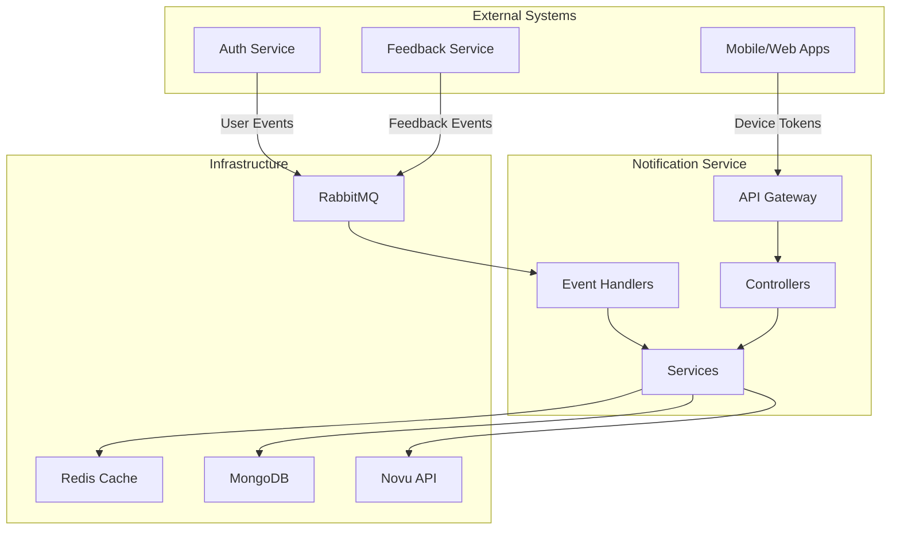

# Tài Liệu Luồng Hệ Thống - Notification Service

## Tổng Quan Hệ Thống

Hệ thống Notification Service là một microservice được xây dựng bằng NestJS, chuyên xử lý việc gửi thông báo đa kênh (push notification, email, in-app) thông qua tích hợp với Novu API. Hệ thống sử dụng kiến trúc event-driven với RabbitMQ, Redis cache, và MongoDB để lưu trữ dữ liệu.

## Kiến Trúc Tổng Thể



## Các Luồng Chính

### 1. Luồng Đăng Ký Device Token

**Mục đích**: Đăng ký thiết bị để nhận push notification

**Luồng xử lý**:

1. Client gửi request đăng ký device token
2. Hệ thống validate JWT token và thông tin device
3. Kiểm tra compatibility giữa provider và platform
4. Lưu device token vào MongoDB
5. Đồng bộ subscriber với Novu API (async)
6. Trả về response thành công

**API Endpoint**: `POST /api/v1/device-tokens`

**Sample Request**:

```json
{
  "token": "fcm_token_123456789",
  "platform": "android",
  "provider": "fcm",
  "deviceId": "device_123",
  "deviceName": "Samsung Galaxy S21",
  "osVersion": "Android 12",
  "appVersion": "1.0.0"
}
```

**Sample Response**:

```json
{
  "id": "cuid_device_token_123",
  "userId": "user_123",
  "token": "fcm_token_123456789",
  "platform": "android",
  "provider": "fcm",
  "deviceId": "device_123",
  "isActive": true,
  "lastUsedAt": "2024-01-15T10:30:00Z",
  "deviceName": "Samsung Galaxy S21",
  "osVersion": "Android 12",
  "appVersion": "1.0.0",
  "createdAt": "2024-01-15T10:30:00Z",
  "updatedAt": "2024-01-15T10:30:00Z"
}
```

### 2. Luồng Xử Lý Event Từ RabbitMQ

**Mục đích**: Xử lý các event từ các service khác để tạo notification

**Luồng xử lý**:

1. RabbitMQ nhận event từ Auth Service hoặc Feedback Service
2. Event Handler xử lý event tương ứng
3. Tạo notification record trong MongoDB
4. Đưa vào Priority Queue theo mức độ ưu tiên
5. Worker xử lý notification và gửi qua Novu
6. Cập nhật trạng thái notification

**Các Event Types**:

- `auth.UserCreatedEvent`
- `auth.UserUpdatedEvent`
- `auth.UserRoleChangedEvent`
- `auth.UserDeletedEvent`
- `feedback.FeedbackCreatedEvent`
- `feedback.StatusChangedEvent`
- `feedback.SLABreachedEvent`
- `feedback.CommentAddedEvent`

**Sample Event Data**:

```json
{
  "eventType": "auth.UserCreatedEvent",
  "timestamp": "2024-01-15T10:30:00Z",
  "payload": {
    "userData": {
      "userId": "user_123",
      "email": "user@example.com",
      "name": "John Doe",
      "phone": "+84123456789",
      "role": "RESIDENT",
      "apartment": "A101",
      "building": "Building A",
      "isActive": true
    }
  }
}
```

### 3. Luồng Xử Lý Priority Queue

**Mục đích**: Xử lý notification theo mức độ ưu tiên

**Luồng xử lý**:

1. Message được route vào queue tương ứng với priority
2. Worker xử lý message theo thứ tự ưu tiên
3. Gọi Novu API để gửi notification
4. Cập nhật trạng thái và metrics
5. Xử lý retry nếu thất bại

**Priority Levels**:

- `URGENT`: Xử lý ngay lập tức
- `HIGH`: Xử lý trong vòng 1 phút
- `NORMAL`: Xử lý trong vòng 5 phút
- `LOW`: Xử lý trong vòng 15 phút

**Sample Priority Message**:

```json
{
  "id": "msg_123",
  "userId": "user_123",
  "type": "emergency",
  "priority": "urgent",
  "title": "Emergency Alert",
  "body": "Fire alarm activated in building",
  "channels": ["push", "email"],
  "data": {
    "building": "Building A",
    "floor": "1",
    "timestamp": "2024-01-15T10:30:00Z"
  }
}
```

### 4. Luồng Quản Lý User Preferences

**Mục đích**: Cho phép user cấu hình preferences nhận notification

**API Endpoints**:

- `GET /api/v1/preferences` - Lấy preferences của user
- `PUT /api/v1/preferences` - Cập nhật preferences

**Sample Request (Update Preferences)**:

```json
{
  "channels": {
    "push": true,
    "email": true,
    "inApp": false
  },
  "types": {
    "payment": true,
    "booking": true,
    "announcement": false,
    "emergency": true
  },
  "quietHours": {
    "enabled": true,
    "startTime": "22:00",
    "endTime": "07:00",
    "timezone": "Asia/Ho_Chi_Minh"
  }
}
```

**Sample Response**:

```json
{
  "success": true,
  "message": "Preferences updated successfully",
  "data": {
    "id": "pref_123",
    "userId": "user_123",
    "channelPreferences": {
      "push": true,
      "email": true,
      "inApp": false
    },
    "typePreferences": {
      "payment": true,
      "booking": true,
      "announcement": false,
      "emergency": true
    },
    "quietHours": {
      "enabled": true,
      "startTime": "22:00",
      "endTime": "07:00",
      "timezone": "Asia/Ho_Chi_Minh"
    },
    "createdAt": "2024-01-15T10:30:00Z",
    "updatedAt": "2024-01-15T10:30:00Z"
  },
  "timestamp": "2024-01-15T10:30:00Z"
}
```

### 5. Luồng Quản Lý Categories

**Mục đích**: Quản lý các danh mục notification và thành viên

**API Endpoints**:

- `POST /api/v1/categories` - Tạo category mới (Admin only)
- `GET /api/v1/categories` - Lấy danh sách categories
- `PUT /api/v1/categories/:id` - Cập nhật category
- `DELETE /api/v1/categories/:id` - Xóa category
- `POST /api/v1/categories/:id/members` - Thêm thành viên
- `PUT /api/v1/categories/:id/members/:userId` - Cập nhật thành viên
- `DELETE /api/v1/categories/:id/members/:userId` - Xóa thành viên

**Sample Request (Create Category)**:

```json
{
  "name": "Emergency Alerts",
  "description": "Notifications for emergency situations",
  "parentId": null,
  "metadata": {
    "icon": "alert-triangle",
    "color": "#ff4444",
    "priority": 1,
    "tags": ["emergency", "safety"]
  }
}
```

## Các Hệ Thống Hỗ Trợ

### 1. RabbitMQ Message Queue

**Chức năng**: Xử lý event-driven communication giữa các service

**Cấu hình**:

- **Connection**: AMQP connection với retry mechanism
- **Exchanges**: Topic exchanges cho event routing
- **Queues**: Priority queues cho notification processing
- **Dead Letter Queue**: Xử lý message thất bại

**Luồng hoạt động**:

1. Service khác publish event vào RabbitMQ
2. Notification Service consume event
3. Event Handler xử lý event
4. ACK message sau khi xử lý thành công
5. Retry mechanism cho message thất bại

### 2. Redis Cache

**Chức năng**: Cache user preferences, device tokens, và session data

**Cấu hình**:

- **TTL**: 24 giờ cho user data
- **Eviction Policy**: LRU (Least Recently Used)
- **Persistence**: RDB + AOF cho data durability

**Luồng hoạt động**:

1. Check cache trước khi query database
2. Cache miss → Query database → Store in cache
3. Cache hit → Return cached data
4. Invalidate cache khi data thay đổi

### 3. MongoDB Database

**Chức năng**: Lưu trữ persistent data

**Collections chính**:

- `users`: Thông tin user
- `device_tokens`: Device tokens cho push notification
- `notifications`: Notification records
- `user_preferences`: User notification preferences
- `categories`: Notification categories
- `audit_logs`: Audit trail

**Indexes**:

- User email (unique)
- Device token userId
- Notification status + createdAt
- Category membership

### 4. Novu Integration

**Chức năng**: Gửi notification đa kênh

**Luồng hoạt động**:

1. Tạo subscriber trong Novu khi user đăng ký
2. Trigger workflow khi có notification
3. Novu xử lý delivery theo channel preferences
4. Webhook callback để update delivery status

**Retry Mechanism**:

- 5 attempts với exponential backoff
- Circuit breaker khi Novu API down
- Queue backup trong Redis

### 5. Health Check System

**Endpoints**:

- `GET /health` - Overall health status
- `GET /health/database` - MongoDB connection
- `GET /health/redis` - Redis connection
- `GET /health/rabbitmq` - RabbitMQ connection
- `GET /health/novu` - Novu API status

**Sample Health Response**:

```json
{
  "status": "ok",
  "info": {
    "database": { "status": "up" },
    "redis": { "status": "up" },
    "rabbitmq": { "status": "up" },
    "novu": { "status": "up" }
  },
  "error": {},
  "details": {
    "database": { "status": "up" },
    "redis": { "status": "up" },
    "rabbitmq": { "status": "up" },
    "novu": { "status": "up" }
  }
}
```

## Sample Data cho Testing

### 1. User Data

```json
{
  "userId": "user_123",
  "email": "john.doe@example.com",
  "phone": "+84123456789",
  "name": "John Doe",
  "role": "RESIDENT",
  "apartment": "A101",
  "building": "Building A",
  "isActive": true
}
```

### 2. Device Token Data

```json
{
  "token": "fcm_token_123456789",
  "platform": "android",
  "provider": "fcm",
  "deviceId": "device_123",
  "deviceName": "Samsung Galaxy S21",
  "osVersion": "Android 12",
  "appVersion": "1.0.0"
}
```

### 3. Notification Data

```json
{
  "title": "Maintenance Notice",
  "body": "Elevator maintenance scheduled for tomorrow 9AM-12PM",
  "type": "announcement",
  "priority": "normal",
  "channels": ["push", "email"],
  "targetRoles": ["RESIDENT"],
  "targetUsers": ["user_123"],
  "data": {
    "building": "Building A",
    "maintenanceType": "elevator",
    "scheduledTime": "2024-01-16T09:00:00Z"
  }
}
```

### 4. Category Data

```json
{
  "name": "Building Updates",
  "description": "General building maintenance and updates",
  "metadata": {
    "icon": "building",
    "color": "#4CAF50",
    "priority": 2,
    "tags": ["maintenance", "building"]
  }
}
```

## Monitoring và Metrics

### 1. Prometheus Metrics

- Notification sent count
- Message processing duration
- Queue depth
- Error rates
- API response times

### 2. Logging

- Structured logging với correlation ID
- Audit trail cho tất cả operations
- Error tracking và alerting

### 3. Alerting Rules

- High error rate (>5%)
- Queue depth threshold (>1000 messages)
- API response time (>5s)
- Database connection failures

## Security

### 1. Authentication

- JWT token validation
- Role-based access control
- API rate limiting

### 2. Data Protection

- Encryption at rest
- Secure communication (HTTPS)
- PII data masking

### 3. Audit

- Complete audit trail
- User action tracking
- Security event logging

## Performance Optimization

### 1. Caching Strategy

- Redis cache cho frequent queries
- Database query optimization
- Connection pooling

### 2. Queue Processing

- Priority-based processing
- Concurrent workers
- Batch processing

### 3. Database Optimization

- Proper indexing
- Query optimization
- Connection pooling

## Troubleshooting

### 1. Common Issues

- RabbitMQ connection failures
- Novu API timeouts
- Database connection issues
- Redis cache misses

### 2. Debug Steps

1. Check health endpoints
2. Review application logs
3. Monitor queue depths
4. Verify external service connectivity

### 3. Recovery Procedures

- Restart failed workers
- Clear stuck messages
- Reset circuit breakers
- Restore from backup
